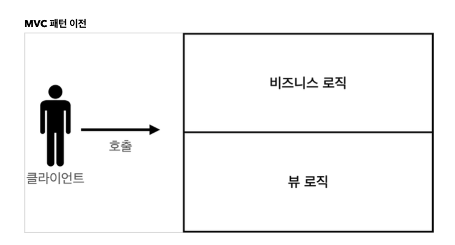
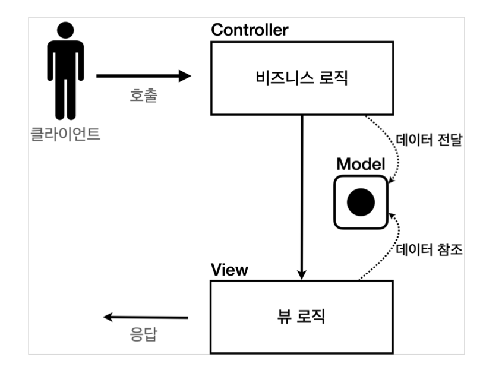
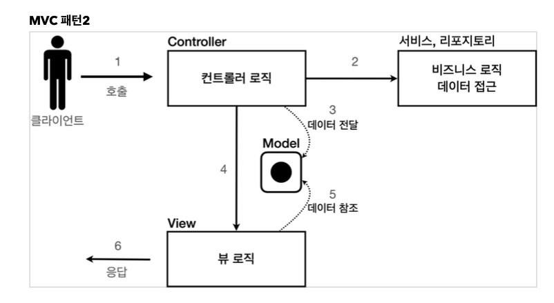
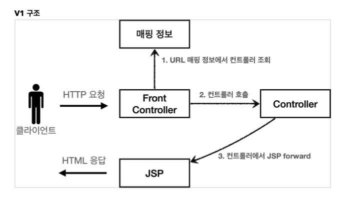
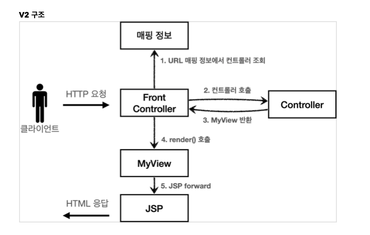
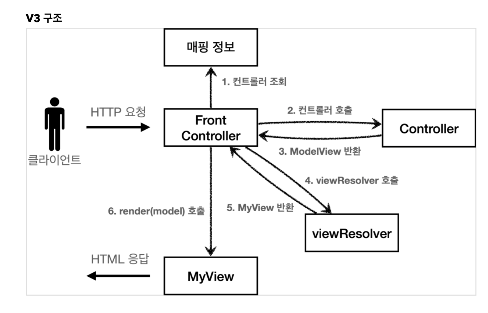
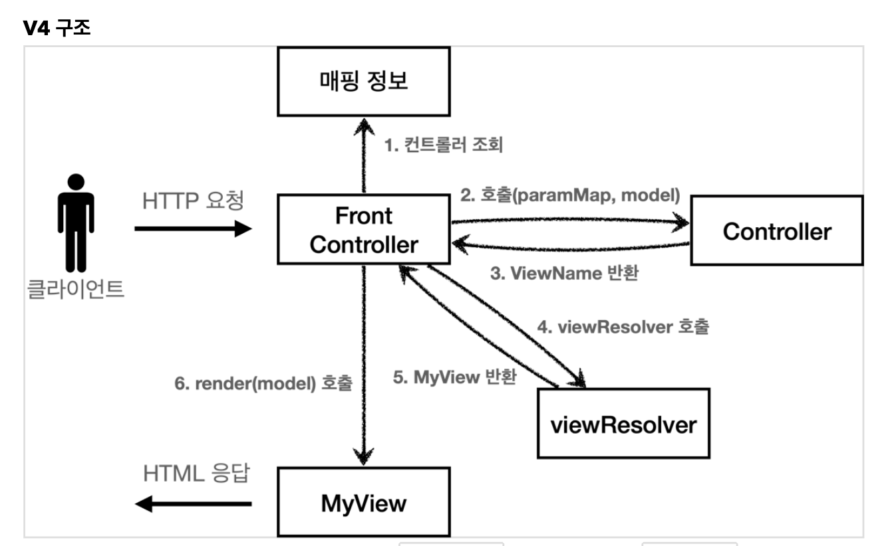
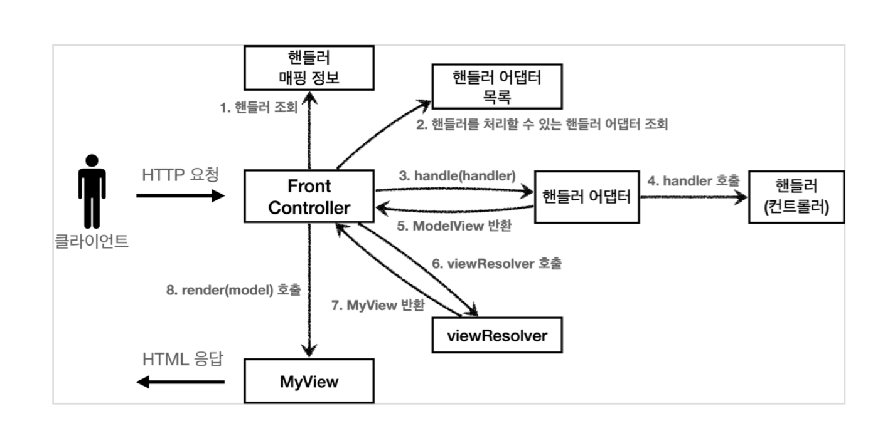
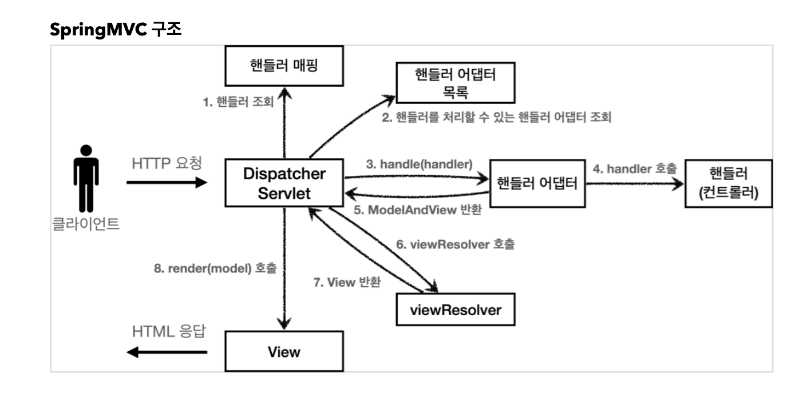

# HTML, HTTP API, CSR, SSR

## 정적 리소스 
- 고정된 HTML 파일, CSS, JS, 이미지, 영상 등 

## HTML 페이지 
- 동적으로 필요한 HTML 파일을 생성해서 전달 
- 요청 --> WAS --> DB --> HTML (화면 렌더링)

## HTTP API 
- 요청 --> WAS --> DB --> Json DATA 
- 주로 JSON 형태로 데이터 통신 
- 앱 클라이언트 -> 서버, 웹 클라이언트 -> 서버, 서버 -> 서버

## 서버 생성 시 고려해야할 사항 
1. 정적 리소스 어캐 제공
2. 동적 HTML 페이지 어캐 제공 
3. HTTP 데이터 어캐 제공 

## SSR - 서버사이드 렌더링
- 서버에서 동적 처리와 함께 화면 페이지까지 제공 
- ex) JSP, 타임리프 
- 요청 -> 서버 -> DB -> HTML 

## CSR - 클라이언트 사이드 렌더링 
- HTML 결과를 자바스크림트를 사용해 웹 브라우저에서 동적을 생성해서 적용 
- ex) React, Vue.js 
- 요청 -> 서버 -> DB -> 자바스크립트 

## WAS
- HTTP 요청 메시지를 연결하고 받아들이는 웹 서버의 역할 
- HttpServletRequest, HttpServletResponse를 생성하고, 서블릿을 호출하는 서블릿 컨테이너의 역할 

# 서블릿
- @ServletComponentScan 서블릿 자동 등록
- @WebServlet의 name 속성을 따로 명시하지 않으면 해당 클래스의 이름을 name 속성으로 사용.
- @WebServlet은 WebServletHandler에 의해 처리되는데 이때 handler가 @WebServlet의 name 속성을 사용하여 BeanDefinition을 만듦. 
- ```
  @WebServlet(name = "helloServlet"), urlPatterns = "/hello")
  public class HelloServlet extends HttpServlet { 
  
    @Override
    public void service(HttpServletRequest request, HttpServletResponse response) throws ServletException, IOException {
       //service logic
    }
  }
  ```
## 서블릿 컨테이너 동작 방식 
- 스프링 부트 -> 내장 톰캣 서버(서블릿 컨테이너) -> HttpServletRequest, HttpServletResponse 생성 -> helloServlet 호출 -> response  
- 참고
  + HTTP 응답에서 Content-Length는 웹 애플리케이션 서버가 자동으로 생성해준다.

# HttpServletRequest 
- `HTTP 요청 메시지를 편리하게 사용할 수 있도록 개발자 대신에 HTTP 요청 메시지를 파싱한다. 그리고 그 결과를 HttpServletRequest 객체에 담아서 제공한다.`
- HttpServletRequest, HttpServletResponse를 사용할 때 가장 중요한 점은 이 객체들이 HTTP 요청 메시지, HTTP 응답 메시지를 편리하게 사용하도록 도와주는 객체라는 점이다
- [HttpServletRequest가 제공하는 메서드로 HTTP 요청 정보들을 조회할 수 있다](./src/main/java/hello/servlet/basic/request/RequestHeaderServlet.java)


# HTTP 요청 데이터 
## GET - 쿼리 파라미터 
- 메시지 바디 없이, URL 쿼리 파라미터에 데이터를 포함해 전달한다. 
- 쿼리 파라미터는 `?`를 시작으로 보낼 수 있다. 추가 파라미터는 `&`로 구분한다. 
  + `http://localhost:8080/request-param?username=hello&age=20`
- 예) 검색, 필터, 페이징등에서 많이 사용
- HttpServletRequest가 제공하는 메서드를 통해 쿼리 파라미터를 편리하게 조회할 수 있다.
  + getParameterNames(): 파라미터 이름 모두 조회 
  + getParamterMap(): 파라미터를 Map으로 조회 
  + String[] getParameterValues(): 이름이 같은 복수 파라미터 조회 
- username=hello&username=hi 처럼 파라미터 이름은 같인데, 값이 중복이라면? 
  + getParameterValues()로 모두 조회할 수 있다. 
  + getParameter()로 조회하면 첫 번째 값을 반환한다. 
- GET URL 쿼리 파라미터 형식으로 클라이언트에서 서버로 데이터를 전달할 때는 HTTP 메시지 바디를 사용하지 않기 때문에 content-type이 없다.
 
## POST - HTML form
- [HTML form으로 서버에 데이터를 전송하는 방법](./src/main/webapp/basic/hello-form.html)
  + ```
    <form action="/request-param" method="post">
        username: <input type="text" name="username" /> age: <input type="text" name="age" /> <button type="submit">전송</button>
    </form>
    ```  
- 생성되는 HTTP 메시지 
  + 요청 URL: http://localhost:8080/request-param
  + content-type: application/x-www-form-urlencoded
  + message body: username=hello&age=20. 메시지 바디에 쿼리 파라미터 형식으로 전달 
- `웹브라우저가 HTTP 메시지 형식을 만들어줌` 
  + ```
    POST /save HTTP/1.1
    Host: localhost:8080
    Content-Type: application/x-www-form-urlencoded
    
    username=kim&age=20
    ```
- 앞서 GET에서 살펴본 쿼리 파라미터 형식과 같기 때문에 request.getParameter()로 조회할 수 있다. 
- `정리하면 request.getParameter() 는 GET URL 쿼리 파라미터 형식도 지원하고, POST HTML Form 형식도 둘 다 지원한다.`
- POST HTML Form 형식으로 데이터를 전달하면 바디로 보내는 것이기 때문에 `content-type을 applicaion/x-www-form-urlencoded로 꼭 지정해야한다.` 
  
## HTTP message body
- HTTP API에서 주로 사용. JSON, XML, TEXT 
- POST, PUT, PATCH
### [HTTP request Data - API 메시지 바디 - 단순 텍스트](./src/main/java/hello/servlet/basic/request/RequestBodyStringServlet.java) 
- HTTP 메시지 바디의 데이터를 InputStream을 사용해서 직접 읽을 수 있다.
- 문자 전송 
  + POST http://localhost:8080/request-body-string content-type: text/plain
  + message body: hello
  + 결과: messageBody = hello
- ```
  ServletInputStream inputStream = request.getInputStream();
  String messageBody = StreamUtils.copyToString(inputStream, StandardCharsets.UTF_8);
  
  System.out.println("messageBody = " + messageBody);
  ```
### [HTTP request Data - API 메시지 바디 - JSON](./src/main/java/hello/servlet/basic/request/RequestBodyJsonServlet.java)
- 문자 전송 
  + POST http://localhost:8080/request-body-json 
  + content-type: application/json
  + message body: {"username": "hello", "age": 20} 
  + 결과: messageBody = {"username": "hello", "age": 20}  
- ```
  ServletInputStream inputStream = request.getInputStream();
  String messageBody = StreamUtils.copyToString(inputStream, StandardCharsets.UTF_8);
  
  HelloData helloData = objectMapper.readValue(messageBody, HelloData.class);
  System.out.println("helloData = " + helloData);
  ```  
  
# HTTP 응답 - HttpServletResponse 
## HttpServletResponse - 기본 사용 방법 
- [HTTP 응답 메시지 생성](./src/main/java/hello/servlet/basic/response/ResponseHeaderServlet.java) 
  + HTTP 응답코드 지정. response.setStatus(HTTPServletResponse.SC_OK)
  + 해더 생성. response.setHeader("Content-Type", "text/plain;charset=utf-8") 
  + 바디 생성. response.getWriter().write("body")
- 편의 기능 제공  
  + content-type. response.setContentType("text/plain)
  + 쿠키. response.addCookie(cookie)
  + Redirect. response.sendRedirect("/basic/hello-form.html")

## [HttpServletReponse 응답 데이터 - 단순 텍스트, HTML](./src/main/java/hello/servlet/basic/response/ResponseHtmlServlet.java)
- `content-type=text/html`, `charset=utf-8` 지정 필요 
  + response.setContentType("text/html"), response.setCharacterEncoding("utf-8")
- ```
  PrintWriter writer = response.getWriter();
  writer.println("<html>");
  writer.println("<body>");
  writer.println("   <div>안녕?</div>");
  writer.println("</body>");
  writer.println("</html>");
  ``` 
  
## [HttpServletReponse 응답 데이터 - API JSON](./src/main/java/hello/servlet/basic/response/ResponseJsonServlet.java) 
- `content-type=application/json`, `charset=utf-8` 지정 필요 
  + response.setContentType("application/json"), response.setCharacterEncoding("utf-8")
- Jackson 라이브러리로 JSON 문자로 변경. objectMapper.writerValueAsString(object)
- ```
  String result = objectMapper.writerValueAsString(helloData);
  response.getWriter().writer(result);
  ```
  
# 서블릿으로 회원 관리 웹 애플리케이션 만들기 
- [회원 등록](./src/main/java/hello/servlet/web/servlet/MemberSaveServlet.java)
- [회원 목록](./src/main/java/hello/servlet/web/servlet/MemberListServlet.java)
## 템플릿 엔진으로 
- 서블릿 덕분에 동적인 HTML 문서를 만들 수 있었다. 정적인 HTML 문서라면 화면이 계속 달라지는 회원의 저장 결과라던가, 회원 목록 같은 동적인 HTML을 만드는 일은 불가능 할 것이다.
  + ```
    String username = request.getParameter("username");
    int age = Integer.parseInt(request.getParameter("age"));

    Member member = new Member(username, age);
    memberRepository.save(member);

    response.setContentType("text/html");
    response.setCharacterEncoding("utf-8");
    PrintWriter w = response.getWriter();
    w.write("<html>\n" +
            "<head>\n" +
            " <meta charset=\"UTF-8\">\n" + "</head>\n" +
            "<body>\n" +
            "성공\n" +
            "<ul>\n" +
            " <li>id="+member.getId()+"</li>\n" +
            " <li>username="+member.getUsername()+"</li>\n" +
            " <li>age="+member.getAge()+"</li>\n" + "</ul>\n" +
            "<a href=\"/index.html\">메인</a>\n" + "</body>\n" +
            "</html>");
    ``` 
- `자바 코드에 HTML만드는 코드가 섞여있어서 매우 복잡하고 비효율적이다. 자바 코드로 HTML을 만드는 것보다 HTML 문서에 동적으로 변경해야 하는 부분만 자바 코드를 넣는게 더 편리할 것이다.` => JSP 등장
- 이게 바로 템플릿 엔진이 나온 이유다. 템플릿 엔진을 사용하면 HTML 문서에서 필요한 곳만 코드를 적용해 동적으로 변경할 수 있다. 
- 템플릿 엔진에는 JSP, Thymeleeaf, Freemarker, Velocity 등이 있다.

# JSP로 회원 관리 웹 애플리케이션 만들기
- `<%@ page contentType="text/html;charset=UTF-8" language="java" %>` 첫 줄은 JSP문서라는 뜻이다. JSP 문서는 이렇게 시작해야 한다.
- 회원 등록 폼 JSP를 보면 첫 줄을 제외하고는 완전히 HTML와 똑같다. `JSP는 서버 내부에서 서블릿으로 변환`되는데, 우리가 만들었던 MemberFormServlet과 거의 비슷한 모습으로 변환된다.
- `<% ~ %>` 태그 안에 자바 코드를 입력할 수 있다. 
  + `<%= ~ %>` 자바 코드를 출력할 수 있다.
- 회원 저장 JSP를 보면, 회원 저장 서블릿 코드와 같다. 다른 점이 있다면, HTML을 중심으로 하고, 자바 코드를 부분부분 입력해주었다. 
## 서블릿과 JSP의 한계 
- 서블릿으로 개발할 때는 뷰(View)화면을 위한 HTML을 만드는 작업이 자바 코드에 섞여서 지저분하고 복잡했다. JSP를 사용한 덕분에 뷰를 생성하는 HTML 작업을 깔끔하게 가져가고, 중간중간 동적으로 변경이 필요한 부분에만 자바 코드를 적용했다. 
- 하지만 코드의 상위 절반은 회원을 저장하기 위한 비즈니스 로직이고, 나머지 하위 절반만 결과를 HTML로 보여주기 위한 뷰 영역이다. 
- `JAVA 코드, 데이터를 조회하는 리포지토리 등등 다양한 코드가 모두 JSP에 노출되어 있다. JSP가 너무 많은 역할을 한다.`  

# MVC 패턴 
## 너무 많은 역할 
- `하나의 서블릿이나 JSP만으로 비즈니스 로직과 뷰 렌더링까지 모두 처리하게 되면, 너무 많은 역할을 하게되고, 결과적으로 유지보수가 어려워진다.` 
- 비즈니스 로직을 호출하는 부분에 변경이 발생해도 해당 코드를 손대야 하고, UI를 변경할 일이 있어도 비즈니스 로직이 함께 있는 해당 파일을 수정해야 한다.
## 기능 특화 
- 특히 JSP 같은 뷰 템플릿은 화면을 렌더링 하는데 최적화 되어 있기 때문에 이 부분의 업무만 담당하는 것이 가장 효과적이다.
## Model View Controller 
- 컨트롤러: HTTP 요청을 받아서 파라미터를 검증하고, 비즈니스 로직을 실행한다. 그리고 뷰에 전달할 결과 데이터를 조회해서 모델에 담는다.  
- 모델: 뷰에 출력할 데이터를 담아둔다. 뷰가 필요한 데이터를 모두 모델에 담아서 전달해주는 덕분에 뷰는 비즈니스 로직이나 데이터 접근을 몰라도 되고, 화면을 렌더링 하는 일에 집중할 수 있다. 
- 뷰: 모델에 담겨있는 데이터를 사용해서 화면을 그리는 일에 집중한다. 여기서는 HTML을 생성하는 부분을 말한다. 

- 
- 
- 

## MVC 패턴 적용
- Model은 HttpServletRequest 객체를 사용한다. request는 내부에 데이터 저장소를 가지고 있는데, request.setAttribute(), reuqest.getAttribute()를 사용하면 데이터를 보관, 조회할 수 있다. 
- `dispatcher.forward()`로 다른 서블릿이나 JSP로 이동할 수 있다. 서버 내부에서 다시 호출이 발생한다. 
- `/WEB-INF` 안에 JSP가 있으면 외부에서 직접 JSP를 호출할 수 없다. 항상 컨트롤러를 통해서 호출해야한다. 
  + localhost:8080/jsp/members.jsp. 가능  
  + localhost:8080/WEB-INF/views/members.jsp. 불가능 
- `redirect` vs `forward` 
  + redirect
    - 리다이렉트는 실제 웹 브라우저에 응답이 나갔다가, 클라이언트가 redirect 경로로 다시 요청하는 것. 따라서 클라이언트가 인지할 수 있고, URL 경로도 변경된다.
    - 클라이언트 -> 서버 -> 클라이언트가 리다이렉트 호출 -> 서버   
  + forward
    - 포워드는 서버 내부에서 일어나는 호출이기 때문에 클라이언트가 전혀 인지하지 못한다.
    - 클라이언트 -> 서버 -> 서버가 포워트 호출 
- MVC 덕분에 컨트롤러 로직과 뷰 로직을 확실하게 분리할 수 있다. 이후 화면 수정이 발생하면 뷰 로직만 변경하면 된다. 
  + 뷰
    ```
    <ul>
        <li>id=${member.id}</li>
        <li>username=${member.username}</li>
        <li>age=${member.age}</li>
    </ul>
    ```
  + ```
    @Override
    protected void service(HttpServletRequest request, HttpServletResponse response) throws ServletException, IOException {
        //servlet과 동일한 로
        String username = request.getParameter("username");
        int age = Integer.parseInt(request.getParameter("age"));

        Member member = new Member(username, age);
        memberRepository.save(member);

        //Model에 데이터를 보관한다.
        request.setAttribute("member", member);

        String viewPath = "/WEB-INF/views/save-result.jsp";
        RequestDispatcher dispatcher = request.getRequestDispatcher(viewPath);
        dispatcher.forward(request, response);
    }
    ```

# MVC 패턴 한계 
- MVC 패턴을 적용한 덕분에 컨트롤러의 역할과 뷰를 렌더링 하는 역할을 명확하게 구분할 수 있다. 하지만 중복, 불필요한 코드가 많이 보인다. 
## 포워드 중복
- ```
  RequestDispatcher dispatcher = request.getRequestDispatcher(viewPath);
  dispatcher.forward(request, response);
  ```
## viewPath 중복
- ```
  String viewPath = "/WEB-INF/views/save-result.jsp";
  ``` 
- prefix: /WEB-INF/view/, suffix: .jsp 
- 만약 jsp가 아닌 다른 템플릿 엔진으로 변경한다면 전체 코드를 다 변경해야한다. 
## 공통 처리가 어렵다.   
- 기능이 복잡해질 수 록 컨트롤러에서 공통으로 처리해야 하는 부분이 점점 더 많이 증가할 것이다. 단순히 공통 기능을 메서드로 뽑으면 될 것 같지만, 결과적으로 해당 메서드를 항상 호출해야 하고, 실수로 호출하지 않으면 문제가 될 것이다. 그리고 호출하는 것 자체도 중복이다.
## 공통 처리가 어려우므로 프론트 컨트롤러 패턴을 도입
- 프론트 컨트롤러 패턴을 도입하여 컨트롤러 호출 전에 공통 기능을 처리하면 중복이 사라진다.

# MVC 프레임워크 만들기   
## FrontController 패턴 특징 
- `입구로 하나로 만들어서 프론트 컨트롤러 서블릿 하나로 클라이언트 요청을 받음` 
- `프론트 컨트롤러를 제외한 나머지 컨트롤러는 서블릿을 사용하지 않아도됨` 
## 스프링 웹 MVC와 프론트 컨트롤러 
- 스프링 웹 MVC의 `DispatcherServlet`이 `FrontController 패턴`으로 구현되어있음

# 프론트 컨트롤러 도입 - v1
- 
- 서블릿과 비슷한 모양의 컨트롤러 인터페이스를 도입한다. 각 컨트롤러들은 이 인터페이스를 구현하면 된다. 
- 프론트 컨트롤러는 이 인터페이스를 호출해서 구현과 관계없이 로직의 일관성을 가져갈 수 있다.
  + ```
    public interface ControllerV1 {
      void process(HttpServletRequest request, HttpServletResponse response) throws ServletException, IOException;
    }
    ```
  + ```
    public class MemberSaveControllerV1 implements ControllerV1 {
        @Override 
        public void process(HttpServletRequest request, HttpServletResponse response) throws ServletException, IOException {
            ...
        }
    }
    ```
- 내부 로직은 기존 서블릿과 같다. 프론트 컨트롤러를 만들어보자. 
## 프론트 컨트롤러 분석
- ```
    @WebServlet(name = "frontControllerServletV1", urlPatterns = "/front-controller/v1/*")
    public class FrontControllerServletV1 extends HttpServlet {
    
        private Map<String, ControllerV1> controllerV1Map = new HashMap<>();
    
        public FrontControllerServletV1() {
            controllerV1Map.put("/front-controller/v1/members/new-form", new MemberFormControllerV1());
            controllerV1Map.put("/front-controller/v1/members/save", new MemberSaveControllerV1());
            controllerV1Map.put("/front-controller/v1/members", new MemberListControllerV1());
        }
    
        @Override
        protected void service(HttpServletRequest request, HttpServletResponse response) throws ServletException, IOException {
            System.out.println("FrontControllerServletV1.service");
    
            // /front-controller/v1/members
            String requestURI = request.getRequestURI();
            ControllerV1 controller = controllerV1Map.get(requestURI);
    
            if (controller == null) {
                response.setStatus(HttpServletResponse.SC_NOT_FOUND);
                return;
            }
            controller.process(request, response);
        }
    }
  ```
- urlPatterns
  + `"/front-controller/v1/*"` : /front-controller/v1 를 포함한 하위 모든 요청은 이 서블릿에서 받아들인다
- controllerMap 
  + key: 매핑 URL
  + value: 호출될 컨트롤러 
- service()
  + requestURI로 호출된 컨트롤러를 찾고, 없으면 404 반환 
  + 컨트롤러를 찾았으면 `controller.process(request, response);` 해당 컨트롤러를 실행한다. 

# 프론트 컨트롤러 도입 - v2
- ```
  String viewPath = "/WEB-INF/views/new-form.jsp";
  RequestDispatcher dispatcher = request.getRequestDispatcher(viewPath); 
  dispatcher.forward(request, response);
  ```
- viewPath 중복 부분을 제거하기 위해, 뷰 처리 객체 MyView를 만들자.
  + ```
    public class MyView {
        private String viewPath;
    
        public MyView(String viewPath) {
            this.viewPath = viewPath;
        }
    
        public void render(HttpServletRequest request, HttpServletResponse response) throws ServletException, IOException {
            RequestDispatcher dispatcher = request.getRequestDispatcher(viewPath);
            dispatcher.forward(request, response);
        }
    }
    ``` 
- 
- 각 컨트롤러는 ControllerV2를 구현하여 viewPath를 반환해주면 된다. 
  + `return new MyView("/WEB-INF/views/save-result.jsp")` 
- 그리고 프론트 컨트롤러에서 `view.render()`를 호출하여 forward 로직을 수행하게 한다. 
- `프론트 컨트롤러의 도입으로 MyView 객체의 render()를 호출하는 부분을 모두 일관되게 처리할 수 있다.` 

# Model 추가 - v3 
- 
## 서블릿 종속성 제거 
- `컨트롤러는 HttpServletRequest request, HttpServletResponse response를 제거한 순수한 자바로 변경하자. request 객체는 별도의 Model 객체를 이용하자.` 
- 구현 코드가 매우 단순해지고, 테스트 코드 작성이 쉽다. 
- ```java
  public interface ControllerV3 {
      ModelView process(Map<String, String> paramMap);
  }
  ```
- ```java
  public class MemberSaveControllerV3 implements ControllerV3 {
  
      private MemberRepository memberRepository = MemberRepository.getInstance();
  
      @Override
      public ModelView process(Map<String, String> paramMap) {
          String username = paramMap.get("username")
          int age = Integer.parseInt(paramMap.get("age"));
  
          Member member = new Member(username, age);
          memberRepository.save(member);
  
          ModelView modelView = new ModelView("save-result");
          modelView.getModel().put("member", member);
  
          return modelView;
      }
  }
  ```
## 뷰 이름 중복 제거 
- 뷰 이름을 넘겨줄 때, `/WEB-INF/view/~/~.jsp` 부분이 중복해서 나온다. 
- 컨트롤러는 논리 이름을 반환하고, 실제 물리 위치는 FrontController에서 처리하도록 단순화하자. 
  + `return new MyView("/WEB-INF/views/new-form.jsp")` -> `return new ModelView("new-form")`
- 나중에 폴더 위치가 수정되면 프론트 컨드롤러만 바꾸면 된다.  
- ```
  private MyView viewResolver(ModelView modelView) {
      return new MyView("/WEB-INF/views/" + modelView.getViewName() + ".jsp");
  }
  ```
## ModelView 
- 지금까지 컨트롤러에서 서블릿에 종속적인 HttpServletRequest를 사용했다. request.setAttribute()로 데이터를 담아 뷰에 전달했다. 
- 컨트롤러에서 서블릿의 종속성을 제거하기 위해 Model을 직접 만들고, 추가로 View 이름까지 전달하는 ModelView 객체를 만들어 사용하자. 
- Model 전달, view 전달
  + ```
    ModelView modelView = new ModelView("members");
    modelView.getModel().put("members", members); //request.setAttribute() 대신 사용 
    ```

# 단순하고 실용적인 컨트롤러 - v4
- 
- 컨트롤러에서 항상 ModelView 객체를 생성하고 반환해야 하는 부분이 번거롭다. 이 부분을 해결해보자. 
- ```
  public interface ControllerV4 {
      String process(Map<String, String> paramMap, Map<String, Object> model);
  }
  ``` 
- ModelView를 반환하는 대신 String으로 바꾸고, 파라미터로 model 객체를 넘겨주자. 그럼 ModelView 객체를 생성하지 않고 뷰의 이름만 반환해주면 된다. 
  + `return new ModelView("new-form")` -> `return "new-form"`
- 또한 모델이 파라미터로 전달되기 때문에, 모델을 직접 생성하지 않아도 된다. 
  + `modeView.getModel().put("members", members)` -> `model.put("members", members)`
  
# 유연한 컨트롤러 - v5
- 만약 어떤 개발자는 ControllerV3 방식으로 개발하고 싶고, 어떤 개발자는 ControllerV4 방식으로 개발하고 싶다면?
  + ```
    public interface ControllerV3 {
        ModelView process(Map<String, String> paramMap);
    }
    ```
  + ```
    public interface ControllerV4 {
        String process(Map<String, String> paramMap, Map<String, Object> model);
    }
    ```
## 어댑터 패턴 
- ControllerV3, ControllerV4는 완전히 다른 인터페이스므로 호환이 불가능하다. 마치 v3는 110v이고, v4는 220v 전기 콘센트 같은 것이다. 이를 호환하고 싶을 때 어댑터가 필요하다. 
- 어댑터 패턴을 사용하면 클라이언트는 호환되지 않던 인터페이스도 사용할 수 있다. 
## 구조 
- 
- 핸들러 어댑터: 중간에 어댑터 역할을 하는 어댑터가 추가되었는데 이름이 핸들러 어댑터이다. 여기서 어댑터 역할을 해주는 덕분에 다양한 종류의 컨트롤러를 호출할 수 있다.
- 핸들러: 컨트롤러의 이름을 더 넓은 범위인 핸들러로 변경했다. 그 이유는 이제 어댑터가 있기 때문에 꼭 컨트롤러의 개념 뿐만 아니라 어떠한 것이든 해당하는 종류의 어댑터만 있으면 다 처리할 수 있기 때문이다.
## 구현
- ```java
  public interface MyHandlerAdapter {
    boolean supports(Object handler);
    ModelView handle(HttpServletRequest request, HttpServletResponse response, Object handler) throws ServletException, IOException;
  }
   
  ```
- `boolean supports` 
  + 어댑터가 해당 컨트롤러를 처리할 수 있는지 판단하는 메서드 
- `ModelView handle(...)` 
  + 실제 컨트롤러를 호출하는 메서드. 
  + 어댑터는 실제 컨트롤러를 호출하고, 그 결과로 ModelView를 반환해아한다. 
- ```java
  public class ControllerV3HandlerAdapter implements MyHandlerAdapter {
      
      //ControllerV3 컨트롤러를 처리할 수 있는지 판단 
      @Override
      public boolean supports(Object handler) {
          return (handler instanceof ControllerV3);
      }
  
      //ControllerV3 컨트롤러로 변환 후, 실제 컨트롤러 호출하여 수행 후 ModelView 형식으로 반환 
      @Override
      public ModelView handle(HttpServletRequest request, HttpServletResponse response, Object handler) throws ServletException, IOException {
          ControllerV3 controller = (ControllerV3) handler;
  
          ModelView modelView = controller.process(createParamMap(request));
  
          return modelView;
      }
  }
  ```
- 이전에는 컨트롤러를 직접 매핑해서 사용했다. `그런데 이제는 어댑터를 사용하기 때문에, 컨트롤러 뿐만 아니라 어댑터가 지원하기만 하면, 어떤 것이라도 URL에 매핑해서 사용할 수 있다. 그래서 이름을 컨트롤러에서 더 넒은 범위의 핸들러로 변경했다.` 
- ```java
  @WebServlet(name = "frontControllerV5", urlPatterns = "/front-controller/v5/*")
  public class FrontControllerServletV5 extends HttpServlet {
  
      private final Map<String, Object> handlerMappingMap = new HashMap<>(); //핸들러 매핑 정보 Map<String, ControllerV3> -> Map<String, Object>
      private final List<MyHandlerAdapter> handlerAdapters = new ArrayList<>();
  
      public FrontControllerServletV5() {
          initHandlerMappingMap(); //핸들러 매핑 초기화 
          initHandlerAdapters(); //어댑터 초기화 
      }
  
      private void initHandlerAdapters() {
          handlerAdapters.add(new ControllerV3HandlerAdapter());
          handlerAdapters.add(new ControllerV4HandlerAdapter());
      }
  
      private void initHandlerMappingMap() {
          handlerMappingMap.put("/front-controller/v5/v3/members/new-form", new MemberFormControllerV3());
          handlerMappingMap.put("/front-controller/v5/v3/members/save", new MemberSaveControllerV3());
          handlerMappingMap.put("/front-controller/v5/v3/members", new MemberListControllerV3());
  
          handlerMappingMap.put("/front-controller/v5/v4/members/new-form", new MemberFormControllerV4());
          handlerMappingMap.put("/front-controller/v5/v4/members/save", new MemberSaveControllerV4());
          handlerMappingMap.put("/front-controller/v5/v4/members", new MemberListControllerV4());
      }
  
      @Override
      protected void service(HttpServletRequest request, HttpServletResponse response) throws ServletException, IOException {
          Object handler = getHandler(request);
  
          if (handler == null) {
              response.setStatus(HttpServletResponse.SC_NOT_FOUND);
              return;
          }
          
         //ControllerV3, ControllerV4 대신 MyHandlerAdapter가 동작 
          MyHandlerAdapter adapter = getHandlerAdapter(handler);
          ModelView modelView = adapter.handle(request, response, handler);
  
          MyView view = viewResolver(modelView);
          view.render(modelView.getModel(), request, response);
      }
  
     //핸들러를 처리할 수 있는 어댑터 조회. ControllerV3, ControllerV4 
      private MyHandlerAdapter getHandlerAdapter(Object handler) {
          for (MyHandlerAdapter adapter : handlerAdapters) {
              if (adapter.supports(handler)) {
                  return adapter;
              }
          }
          throw new IllegalArgumentException("handler adapter를 찾을 수 없습니다. handler = " + handler);
      }
  
      private Object getHandler(HttpServletRequest request) {
          String requestURI = request.getRequestURI();
          return handlerMappingMap.get(requestURI);
      }
  
      private MyView viewResolver(ModelView modelView) {
          return new MyView("/WEB-INF/views/" + modelView.getViewName() + ".jsp");
      }
  }
  ```


# 스프링 MVC

## DispatcherServlet 
- org.springfreamwork.web.servlet.DispatcherServlet
- `DispatcherServlet도 HttpServlet을 상속받아서 사용하고, 서블릿으로 동작한다.`  
- DispatcherServlet을 서블릿으로 자동으로 등록하면 모든 경로 (urlPatterns="/")에 대해서 매핑한다.
- 서블릿이 호출되면 HttpServlet의 service()가 호출되는데, 스프링 MVC는 DispatcherServlet의 부모인 FrameworkServlet에서 service()를 오버라이드 해두었다.   
- FrameworkServlet.service()를 시작으로 여러 메서드가 호출되면서 DispacherServlet.doDispatch()가 호출 된다. 
- ```
  protected void doDispatch(HttpServletRequest request, HttpServletResponse response) throws Exception {
      HttpServletRequest processedRequest = request;
      HandlerExecutionChain mappedHandler = null;
      ModelAndView mv = null;
  
      // 1. 핸들러 조회
      mappedHandler = getHandler(processedRequest); 
      if (mappedHandler == null) {
        noHandlerFound(processedRequest, response);
        return; 
      }
  
      //2.핸들러 어댑터 조회-핸들러를 처리할 수 있는 어댑터
      HandlerAdapter ha = getHandlerAdapter(mappedHandler.getHandler());
  
      // 3. 핸들러 어댑터 실행 -> 4. 핸들러 어댑터를 통해 핸들러 실행 -> 5. ModelAndView 반환 
      mv = ha.handle(processedRequest, response, mappedHandler.getHandler());
      processDispatchResult(processedRequest, response, mappedHandler, mv, dispatchException);
  }
  private void processDispatchResult(HttpServletRequest request, HttpServletResponse response, HandlerExecutionChain mappedHandler, ModelAndView mv, Exception exception) throws Exception {
      // 뷰 렌더링 호출
      render(mv, request, response);
  }
  
  protected void render(ModelAndView mv, HttpServletRequest request, HttpServletResponse response) throws Exception {
      View view;
      String viewName = mv.getViewName(); 
  
      //6. 뷰 리졸버를 통해서 뷰 찾기,7.View 반환
      view = resolveViewName(viewName, mv.getModelInternal(), locale, request);
      
      // 8. 뷰 렌더링
      view.render(mv.getModelInternal(), request, response); 
  }
  ```
## Spring MVC
- 
- 동작 순서
  1. 핸들러 조회: 핸들러 매핑을 통해 요청 URL에 매핑된 `핸들러(컨트롤러)`를 조회한다.
    + 여기서 핸들러는 어떠한 것도 될 수 있다. 컨트롤러, 서블릿, HttpRequestHandler, AAA, BB 등..
  2. 핸들러 어댑터 조회: 핸들러를 실행할 수 있는 `핸들러 어댑터`를 조회한다. 
  3. 핸들러 어댑터 실행: 핸들러 어댑터를 실행한다.
  4. 핸들러 실행: 핸들러 어댑터가 실제 핸들러를 실행한다.
  5. ModelAndView 반환: 핸들러 어댑터는 핸들러가 반환하는 정보를 ModelAndView로 변환해서 반환한다.
  6. viewResolver 호출: 뷰 리졸버를 찾고 실행한다. JSP의 경우: InternalResourceViewResolver 가 자동 등록되고, 사용된다.
  7. View 반환: 뷰 리졸버는 뷰의 논리 이름을 물리 이름으로 바꾸고,렌더링 역할을 담당하는 뷰 객체를 반환한다.
    + JSP의 경우 InternalResourceView(JstlView) 를 반환하는데, 내부에 forward() 로직이 있다.
  8. 뷰 렌더링: 뷰를 통해서 뷰를 렌더링한다.
- 스프링 MVC의 큰 강점은 DispatcherServlet 코드의 변경 없이, 원하는 기능을 변경하거나 확장할 수 있다는 점이다. 지금까지 설명한 대부분을 확장 가능할 수 있게 인터페이스로 제공한다.

# 핸들러 매핑과 핸들러 어댑터 
- 핸들러 매핑과 핸들러 어댑터가 어떤 것들이 어떻게 사용되는지 알아보자. 
- ```
  public interface org.springframework.web.servlet.mvc.Controller {
      ModelAndView handleRequest(HttpServletRequest request, HttpServletResponse
    response) throws Exception;
  }
  ```
- Controller를 상속받아 사용해보자. Controller는 과거에 쓰였던 컨트롤러다.  
- ```
  @Component("/springmvc/old-controller")
  public class OldController implements Controller {
      @Override
      public ModelAndView handleRequest(HttpServletRequest request, HttpServletResponse response) throws Exception {
      System.out.println("OldController.handleRequest");
          return null;
      }
  }
  ```
- http://localhost:8080/springmvc/old-controller. 빈의 이름으로 URL이 매핑됐다. 
- 이 컨트롤러가 호출되려면 다음 2가지가 필요하다. 
  + HandlerMapping
    - 핸들러 매핑에서 이 컨트롤러(핸들러)를 찾을 수 있어야 한다.  
  + HandlerAdapter
    - 핸들러 매핑을 통해서 찾은 핸들러를 실행할 수 있는 핸들러 어댑터가 필요하다. 
  
## HandlerMapping
- 0 순위 RequestMappingHandlerMapping : 애노테이션 기반의 컨트롤러인 @RequestMapping에서 사용
- 1 순위 BeanNameUrlHandlerMapping : 스프링 빈 이름으로 핸들러를 찾는다 

## HandlerAdapter
- 0 순위 RequestMappingHandlerAdapter : 애노테이션 기반의 컨트롤러인 @RequestMapping에서 사용
- 1 순위 HttpRequestHandlerAdapter : HttpRequestHandler 처리
- 2 순위 SimpleControllerHandlerAdapter : Controller 인터페이스(애노테이션X, 과거에 사용) 처리

## OldController 탐색하기 
1. 핸들러 매핑으로 핸들러 조회
  - HandlerMapping을 순서대로 실행해서, 핸들러를 찾는다. 
  - 이 경우 빈 이름으로 핸들러를 찾아야 하기 때문에, BeanNameUrlHandlerMapping이 실행에 성공하고 핸들러인 OldController를 반환한다. (실제로는 Object type으로 받음) 
2. 핸들러 어댑터 조회 
  - HandlerAdapter의 supports()를 순서대로 호출한다. 
  - SimpleControllerHandlerAdapter가 Controller 인터페이스를 지원하므로 대상이 된다. 
3. 핸들러 어댑터 실행 
  - 디스패처 서블릿이 조회한 SimpleControllerHandlerAdapter를 실행하면서 파라미터로 핸들러 정보를 넘겨준다. 
  - SimpleControllerHandlerAdapter는 핸들러인 OldController를 내부에서 실행하고, 그 결과를 반환한다. 
- 정리 - OldController 핸들러매핑, 어댑터 
  + HandlerMapping - BeanNameUrlHandlerMapping
  + HandlerAdapter - SimpleControllerHandlerAdapter 
  
## @RequestMapping
- 현재 스프링에서 사용되는 방식은 애노테이션 기반 컨트롤러로 `RequestMappingHandlerMapping`, `RequestMappingHandlerAdapter` 방식을 사용한다.

# 뷰 리졸버
- OldController에 View를 사용할 수 있도록 코드 추가 return new ModelAndView("new-form")
- http://localhost:8080/springmvc/old-controller 호출해보면, 컨트롤러는 호출됐지만 Whitelabel Error Page 오류가 발생한다. 
- application.properties에 코드 추가 
  + ```
    spring.mvc.view.prefix=/WEB-INF/views/
    spring.mvc.view.suffix=.jsp
    ```
## InternalResourceViewResolver
- 스프링 부트는 InternalResourceViewResolver 라는 뷰 리졸버를 자동으로 등록하는데, 이때 application.properties 에 등록한 spring.mvc.view.prefix , spring.mvc.view.suffix 설정 정보를 사용해서 등록한다.

## 스프링 부트가 자동 등록하는 뷰 리졸버 
- ```
  1 순위 BeanNameViewResolver : 빈 이름으로 뷰를 찾아서 반환한다. (예: 엑셀 파일 생성 기능에 사용)
  2 순위 InternalResourceViewResolver : JSP를 처리할 수 있는 뷰를 반환한다.
  ```
## 동작 방식 
1. 핸들러 어댑터 호출
  - 핸들러 어댑터를 통해 new-form이라는 논리 뷰 이름을 획득한다
2. ViewResolver 호출 
  - new-form이라는 뷰 이름으로 viewResolver를 순서대로 호출한다. 
  - 스프링 빈으로 등록된 뷰가 아니므로 pass되고, InternalResourceViewResolver 가 호출된다.
3. InternalResourceViewResolver
  - 이 뷰 리졸버는 InternalResourceView 를 반환한다. 
4. 뷰 - InternalResourceView
  - InternalResourceView 는 JSP처럼 포워드 forward() 를 호출해서 처리할 수 있는 경우에 사용한다. 
5. view.render()
  - view.render() 가 호출되고 InternalResourceView 는 forward() 를 사용해서 JSP를 실행한다.

## 참고
- InternalResourceViewResolver 는 만약 JSTL 라이브러리가 있으면 InternalResourceView 를 상속받은 JstlView 를 반환한다. JstlView 는 JSTL 태그 사용시 약간의 부가 기능이 추가된다.
- 다른 뷰는 실제 뷰를 렌더링하지만, JSP의 경우 forward() 통해서 해당 JSP로 이동(실행)해야 렌더링이 된다. JSP를 제외한 나머지 뷰 템플릿들은 forward() 과정 없이 바로 렌더링 된다.
- Thymeleaf 뷰 템플릿을 사용하면 ThymeleafViewResolver 를 등록해야 한다. 최근에는 라이브러리만 추가하면 스프링 부트가 이런 작업도 모두 자동화해준다.


