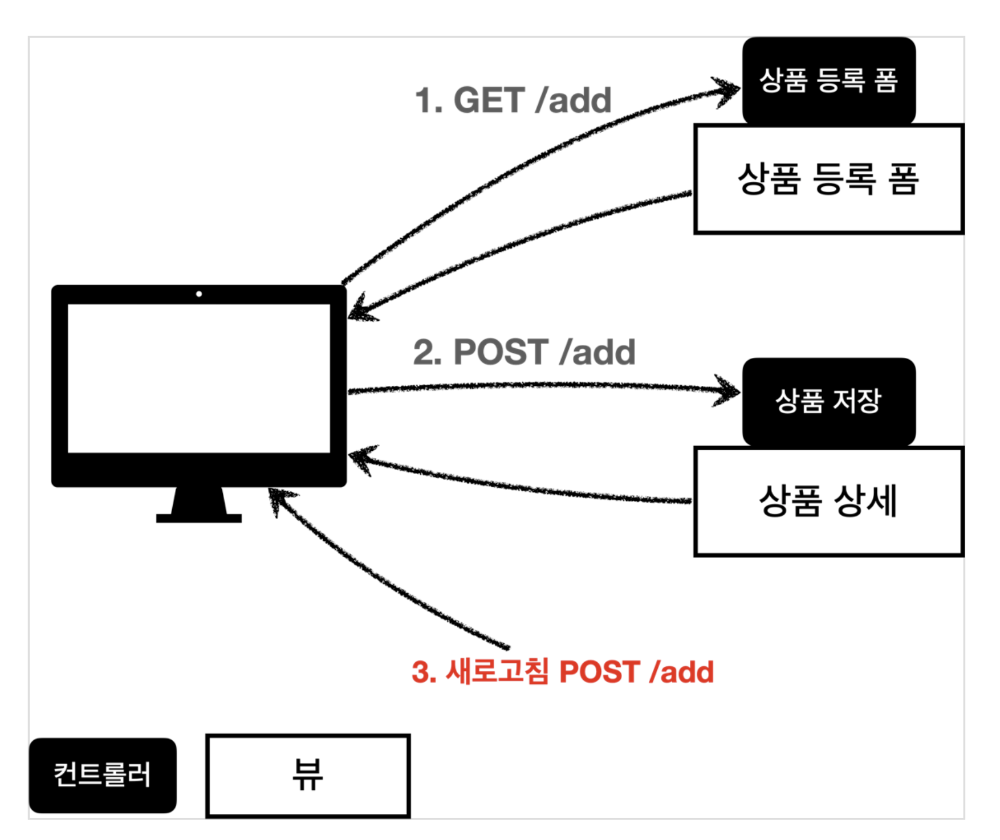
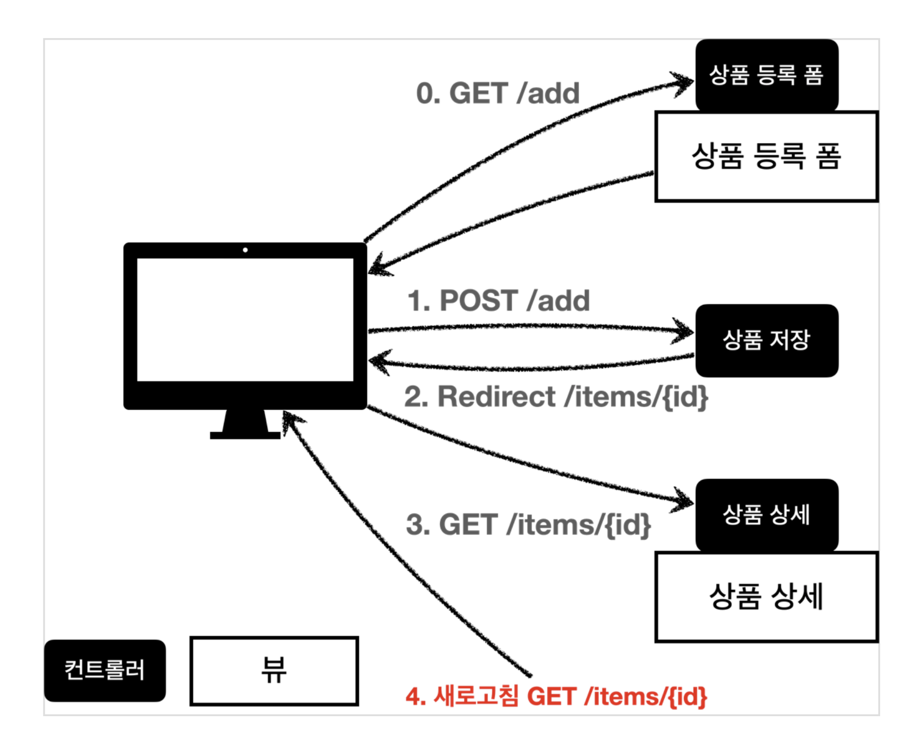

7. 스프링 MVC - 웹 페이지 만들기

# 타임리프 간단히 알아보기 
- `핵심은 th:xxx 가 붙은 부분은 서버사이드에서 렌더링 되고, 기존 것을 대체한다. th:xxx 이 없으면 기존 html의 xxx 속성이 그대로 사용된다.` 
- HTML을 파일로 직접 열었을 때, th:xxx 가 있어도 웹 브라우저는 th: 속성을 알지 못하므로 무시한다. 
- 따라서 HTML을 파일 보기를 유지하면서 템플릿 기능도 할 수 있다.

## 타입리프 사용 선언 
- `<html xmlns:th="http://www.thymeleaf.org">`

## 속성 변경 - th:href 
- `th:href="@{/css/bootstrap.min.css}"`
- href="value1" 을 th:href="value2" 의 값으로 변경한다.

## URL 링크 표현식 - @{...}
- `th:href="@{/css/bootstrap.min.css}"`

## 속성 변경 - th:onclick
- `th:onclick="|location.href='@{/basic/items/add}'|"`

## 리터럴 대체 - |...|
- |...| :이렇게 사용한다.
- 타임리프에서 문자와 표현식 등은 분리되어 있기 때문에 더해서 사용해야 하는데, 리터럴 문법을 사용하면 더하기 없이 편리하게 사용할 수 있다. 
- `<span th:text="'Welcome to our application, ' + ${user.name} + '!'">` -> `<span th:text="|Welcome to our application, ${user.name}!|">`
  
## 반복 출력 - th:each
- `<tr th:each="item : ${items}">`

## 내용 변경 - th:text
- `<td th:text="${item.price}">10000</td>` 

## 정리 
- 타임리프는 순수 HTML을 파일을 웹 브라우저에서 열어도 내용을 확인할 수 있고, 서버를 통해 뷰 템플릿을 거치면 동적으로 변경된 결과를 확인할 수 있다. JSP를 생각해보면, JSP 파일은 웹 브라우저에서 그냥 열면 JSP 소스코드와 HTML이 뒤죽박죽 되어서 정상적인 확인이 불가능하다. 오직 서버를 통해서 JSP를 열어야 한다.
- 이렇게 `순수 HTML을 그대로 유지하면서 뷰 템플릿도 사용할 수 있는 타임리프의 특징을 네츄럴 템플릿 (natural templates)`이라 한다.

# BasicItemController
- 페이지 조회는 @GetMapping으로 설계 
  +  ```
     @GetMapping("/{itemId}/edit")
     public String editForm(@PathVariable Long itemId, Model model) {
         Item item = itemRepository.findById(itemId);
 
         model.addAttribute("item", item);
         return "basic/editForm";
     }
     ```
- 페이지에서 사용하는 기능은 @PostMapping으로 설계
  +  ```
     @PostMapping("/{itemId}/edit")
     public String edit(@PathVariable Long itemId, @ModelAttribute Item item) {
         itemRepository.update(itemId, item);
         return "redirect:/basic/items/{itemId}";
     }
     ```
# PRG Post/Redirect/Get
- 상품 등록 처리 컨트롤러는 심각한 문제가 있다. (addItemV1 ~ addItemV4) 
- 상품 등록을 완료하고 웹 브라우저의 새로고침 버튼을 클릭해보면 상품이 계속해서 중복 등록되는 것을 확인할 수 있다.
- 
- 웹 브라우저의 새로 고침은 마지막에 서버에 전송한 데이터를 다시 전송한다. 
- 그래서 내용은 같고, ID만 다른 상품 데이터가 계속 쌓이게 된다.

## 해결 방법  
- 새로 고침 문제를 해결하려면 상품 저장 후에 뷰 템플릿으로 이동하는 것이 아니라, 상품 상세 화면으로 리다이렉트를 호출해주면 된다.
- 
- ```
  @PostMapping("/add")
  public String addItemV5(Item item) {
      itemRepository.save(item);
      return "redirect:/basic/items/" + item.getId();
  }
  ```
- "redirect:/basic/items/" + item.getId() redirect에서 +item.getId() 처럼 URL에 변수를 더해서 사용하는 것은 URL 인코딩이 안되기 때문에 위험하다. RedirectAttribute를 사용하자. 

# RedirectAttribute 
- 저장이 잘 되었으면 상품 상세 화면에 "저장되었습니다"라는 메시지를 보여달라는 요구사항이 왔다. 간단하게 해결해보자.
- 리다이렉트 할 때 간단히 status=true 를 추가해보자. 그리고 뷰 템플릿에서 이 값이 있으면, 저장되었습니다. 라는 메시지를 출력해보자.

- ```
  /**
   * RedirectAttributes
   */
  @PostMapping("/add")
  public String addItemV6(Item item, RedirectAttributes redirectAttributes) {
        Item savedItem = itemRepository.save(item); 
  
        redirectAttributes.addAttribute("itemId", savedItem.getId()); 
        redirectAttributes.addAttribute("status", true);
        return "redirect:/basic/items/{itemId}";
  }
  ```
- RedirectAttributes 를 사용하면 URL 인코딩도 해주고, pathVarible, 쿼리 파라미터까지 처리해준다.
- redirect:/basic/items/{itemId}
  + pathVariable 바인딩: {itemId}
  + 나머지는 쿼리 파라미터로 처리: ?status=true
- 뷰 템플릿 메시지 추가 
  + ```
    <!-- 추가 -->
    <h2 th:if="${param.status}" th:text="'저장 완료!'"></h2>
    ```