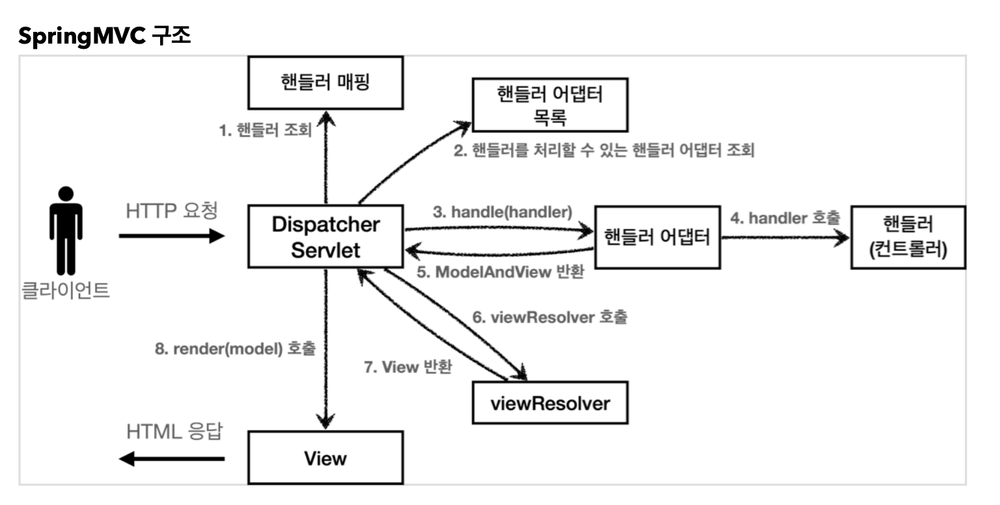
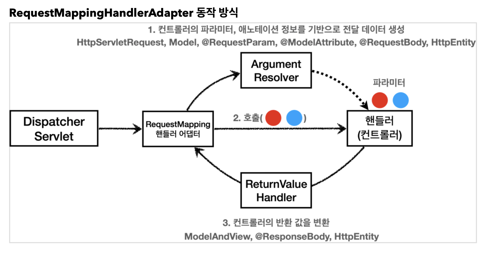
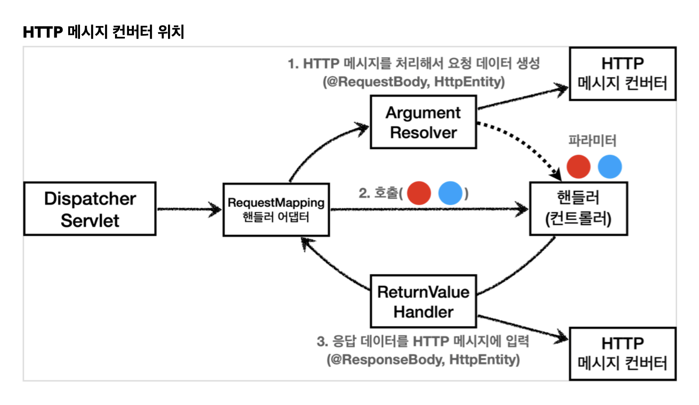

# 6. 스프링 MVC 기본 기능
- HTTP 요청 
  + [쿼리 파라미터, HTML Form](#HTTP-요청-파라미터.-쿼리-파라미터,-HTML-Form)
  + HTTP message body
    + [단순 텍스트](#HTTP-요청-메시지-단순-텍스트) 
    + [JSON](#http-요청-메시지-json)

# 6. 스프링 MVC 기본 기능 
## 프로젝트 생성 
- gradle, java 11, spring boot
- packaging: `Jar`
- Dependencies: Spring Web, Thymeleaf, Lombok
### 주의 
- JSP를 사용하지 않기 때문에 Jar를 선택하는 것이 좋다. Jar를 사용하면 항상 내장 서버(톰캣 등)을 사용하고, webapp 경로도 사용하지 않는다. 
- 내장 서버 사용에 최적화 되어 있는 기능이다. 
- `War를 사용하면 내장 서버도 사용가능 하지만, 주로 외부 서버에 배포하는 목적으로 사용`

# 로깅 알아보기 
## 로깅 라이브러리 
- 스프링 부트 라이브러리를 사용하면 스프링 부트 로깅 라이브러리 `spring-boot-starter-logging`이 함께 포함된다. 
- `스프링 부트는 기본적으로 인터페이스 SLF4J, 구현체 Logback를 사용한다.` 
- 로그 라이브러리는 Logback, Log4J, Log4J2 등 많은 라이브러리가 있는데, 그것을 통합해서 인터페이스로 제공하는 것이 바로 SLF4J 라이브러리다. 
## 로그 선언
- `private final Logger log = LoggerFactory.getLogger(getClass())` 
- `private static final Logger log = LoggerFactory.getLogger(Xxx.class)`
- `@Slf4j` 롬복 사용 가능 
## 로그 호출
- log.trace(" trace log={}", name);
- log.debug(" debug log={}", name);
- log.info(" info log={}", name);
- log.warn(" warn log={}", name);
- log.error(" error log={}", name);
## 로그 출력 
```
2021-08-27 11:37:02.437 TRACE 38418 --- [nio-8080-exec-1] hello.springmvc.basic.LogTestController  :  trace log=Spring
2021-08-27 11:37:02.438 DEBUG 38418 --- [nio-8080-exec-1] hello.springmvc.basic.LogTestController  :  debug log=Spring
2021-08-27 11:37:02.438  INFO 38418 --- [nio-8080-exec-1] hello.springmvc.basic.LogTestController  :  info log=Spring
2021-08-27 11:37:02.438  WARN 38418 --- [nio-8080-exec-1] hello.springmvc.basic.LogTestController  :  warn log=Spring
2021-08-27 11:37:02.438 ERROR 38418 --- [nio-8080-exec-1] hello.springmvc.basic.LogTestController  :  error log=Spring
```
## 로그 레벨 
- LEVEL: TRACE > DEBUG > INFO > WARN > ERROR 
- application.properties 에서 로그 레벨 설정 가능
  + 전체 로그레벨 설정(기본 info) `logging.level.root = info` 
  + hello.springmvc 패키지와 그 하위 로그 레벨 설정 `logging.level.hello.springmvc=debug`
### 주의 
log.debug("data="+data)로 사용하면 안된다. "data="+data 문자 더하기 연산이 발생하기 때문이다. 로그 레벨이 info라면 bebug 로그가 출력되지 않지만 더하기 연산은 수행이 된다. 즉, 의미없는 연산이 발생한다. log.debug("data={}", data)로 사용하면 연산이 발생하지 않으므로 제대로 사용해야 한다. 

## 로그 사용시 장점 
- 쓰레드 정보, 클래스 이름 같은 부가 정보를 함께 볼 수 있고, 출력 모양을 조정할 수 있다.
- 로그 레벨에 따라 개발 서버에서는 모든 로그를 출력하고, 운영서버에서는 출력하지 않는 등 로그를 상황에 맞게 조절할 수 있다.
- 시스템 아웃 콘솔에만 출력하는 것이 아니라, 파일이나 네트워크 등, 로그를 별도의 위치에 남길 수 있다. 특히 파일로 남길 때는 일별, 특정 용량에 따라 로그를 분할하는 것도 가능하다.
- 성능도 일반 System.out보다 좋다. (내부 버퍼링, 멀티 쓰레드 등등) 그래서 실무에서는 꼭 로그를 사용해야 한다.

# [요청 매핑](./src/main/java/hello/springmvc/basic/requestmapping/MappingController.java) 
## HTTP 메서드 매핑 
- @RequestMapping
  + HTTP 메서드 모두 허용 GET, HEAD, POST, PUT, PATCH, DELETE
- @PostMapping
- @PutMapping
- @DeleteMapping
- @PatchMapping
## PathVariable 사용 
- ```
  @GetMapping("/mapping/{userId}")
  public String mappingPath(@PathVariable("userId") String data)
  ```
## PathVariable 사용 - 다중 
- ```
  @GetMapping("/mapping/users/{userId}/orders/{orderId}")
  public String mappingPath(@PathVariable String userId, @PathVariable Long orderId)
  ```
## 특정 파라미터 조건 매핑 
- `@GetMapping(value = "/mapping-param", params = "mode=debug")`
- http://localhost:8080/mapping-param?mode=debug
## 특정 헤더 조건 매핑 
- `@GetMapping(value = "/mapping-header", headers = "mode=debug") `
## 미디어 타입 조건 매핑 - HTTP 요청 Content-Type. consume
- `@PostMapping(value = "/mapping-consume", consumes = "application/json") `
## 미디어 타입 조건 매핑 - HTTP 요청 Accept. produce
- `@PostMapping(value = "/mapping-produce", produces = "text/html") `

# [요청 매핑 - API 예시](./src/main/java/hello/springmvc/basic/requestmapping/MappingClassController.java)
- 회원 목록 조회: GET /users
- 회원 등록: POST /users
- 회원 조회: GET /users/{userId}
- 회원수정: PATCH /users/{userId} 
- 회원 삭제: DELETE /users/{userId}

# HTTP 요청 - 기본, 헤더 조회
- 스프링에서 HTTP 헤더 정보 조회 
- HttpServletRequest request, HttpServletResponse response
- HttpMethod httpMethod. HTTP method
- java.util.Locale locale
- @RequestHeader MultiValueMap<String, String> headerMap
  + 모든 HTTP 헤더를 MultiValueMap 형식으로 조회한다.
- @RequestHeader("host") String host,
- @CookieValue(value = "myCookie", required = false) String cookie

## MultiValueMap 
- MAP과 유사한데, 하나의 키에 여러 값을 받을 수 있다. 
- `keyA=value1&keyA=value2`
- ```
  MultiValueMap<String, String> map = new LinkedMultiValueMap(); map.add("keyA", "value1");
  map.add("keyA", "value2");
  //[value1,value2]
  List<String> values = map.get("keyA");
  ```

## 참고
- @Controller 의 사용 가능한 파라미터 목록은 다음 공식 메뉴얼에서 확인할 수 있다.
  + request https://docs.spring.io/spring-framework/docs/current/reference/html/web.html#mvc-ann-arguments
  + response https://docs.spring.io/spring-framework/docs/current/reference/html/web.html#mvc-ann-return-types

# HTTP 요청 파라미터. 쿼리 파라미터, HTML Form
- 리소스는 /resources/static 아래에 두면 스프링 부트가 자동으로 인식한다.
- Jar 를 사용하면 webapp 경로를 사용할 수 없다. 이제부터 정적 리소스도 클래스 경로에 함께 포함해야한다.
## HTTP 요청 파라미터 - @RequestParam
### 스프링이 제공하는 `@RequestParam` 을 사용하면 요청 파라미터를 매우 편리하게 사용할 수 있다.
- @RequestParam("username") String memberName
### HTTP 파라미터 이름이 변수 이름과 같으면 @RequestParam(name="xx") 생략 가능  
- @RequestParam String username
- @RequestParam 애노테이션을 생략하면 스프링 MVC는 내부에서 required=false 를 적용한다.
### 파라미터 필수 여부 - @RequestParam(request = true) 
- 기본값이 파라미터 필수이다. 
- /request-param
  + username이 없으므로 `400 예외`가 발생함.
- /request-param?username=
  + `파라미터 이름만 있고 값이 없는 경우, 빈문자열로 통과된다.` 
- @RequestParam(required = false) int age, /request-param
  + `null을 int에 입력하는 것은 불가능하므로 500 예외 발생함.` 
  + Integer로 바꾸거나 defaultValue 사용 
### 파라미터를 Map으로 조회하기 - @RequestParam Map<String, Object> paramMap    
- 파라미터를 Map, MultiValueMap으로 조회할 수 있다 
- @RequestParam Map
- @ReuqestParam MultiValueMap. 파라미터 값이 여러 개일때 사용

## HTTP 요청 파라미터 - @ModelAttribute 
- 스프링MVC는 @ModelAttribute가 있으면 다음을 실행한다. 
  + `HelloData` 객체를 생성한다. 
  + 요청 파라미터의 이름으로 `HelloData` 객체의 프로퍼티를 찾는다. 
  + 해당 프로퍼티의 setter를 호출해서 파라미터의 값을 바인딩한다. 조회하면 getter를 호출  
    - 파라미터 이름이 username이면 setUsername() 메서드를 찾아서 값을 입력함 
- age=abc 처럼 숫자가 들어가야 할 곳에 문자를 넣으면 `BindException`이 발생 
- @ModelAttribute는 생략할 수 있다. 근데 @RequestParam도 생략할 수 있으니 혼란이 올 수 있다. 
- 스프링은 해당 생략시 다음과 같은 규칙을 적용한다. 
  + String , int , Integer 같은 단순 타입 = @RequestParam
  + 나머지 = @ModelAttribute (argument resolver 로 지정해둔 타입 외)
  
  
# HTTP 요청 메시지. 단순 텍스트
- HTTP message body에 담긴 데이터를 읽기. 주로 JSON 데이터. POST, PUT, PATCH 메서드. 
- `요청 파라미터와 다르게, HTTP 메시지 바디를 통해 넘어오는 데이터는 @RequestParam, @ModelAttribute를 사용할 수 없다. (HTML Form 요청 제외)`
## v1. HTTP 메시지 바디 데이터는 HttpServletRequest에 InputStream을 사용해 읽을 수 있다. 
- ```
  @PostMapping("/request-body-string-v1")
  public void requestBodyString(HttpServletRequest request, HttpServletResponse response) throws IOException {
    ServletInputStream inputStream = request.getInputStream();
    String messageBody = StreamUtils.copyToString(inputStream, StandardCharsets.UTF_8);
    
    log.info("messageBody={}", messageBody);
    
    response.getWriter().write("ok");
  }
  ```
## v2. 스프링 MVC는 다음 파라미터를 지원한다. InputStream, OutputStream
- `InputStream(Reader): HTTP 요청 메시지 바디의 내용을 직접 조회` 
- `OutputStream(Writer): HTTP 응답 메시지의 바디에 직접 결과 출력` 
- ```
  @PostMapping("/request-body-string-v2")
  public void requestBodyStringV2(InputStream inputStream, Writer reponseWirter) throws IOException {
      String messageBody = StreamUtils.copyToString(inputStream, StandardCharsets.UTF_8);

      log.info("messageBody={}", messageBody);

      reponseWirter.write("ok");
  }
  ```
## v3. 스프링 MVC는 다음 파라미터를 지원한다. HttpEntity
- HttpEntity: HTTP header, body 정보를 편리하게 조회 
  + httpEntity.getBody(), httpEntity.getHeaders()
  + 요청 파라미터 @RequestParam, @ModelAttribute와는 관계 없음 
- HttpEntity는 응답에도 사용 가능
  + 헤더 정보 포함 가능
  + `view 조회 x`  
- HttpEntity를 상속받은 RequestEntity, ResponseEntity도 있다. 
  + RequestEntity
    - HttpMethod, url 정보가 추가, 요청에서 사용
  + ResponseEntity
    - HTTP 상태 코드 설정 가능, 응답에서 사용
    -  return new ResponseEntity<String>("Hello World", responseHeaders, HttpStatus.CREATED)
    
## v4. @RequestBody
- `@RequestBody 를 사용하면 HTTP 메시지 바디 정보를 편리하게 조회할 수 있다.` 
  + 참고로 헤더 정보가 필요하다면 HttpEntity 를 사용하거나 @RequestHeader 를 사용하면 된다.
- 이렇게 메시지 바디를 직접 조회하는 기능은 요청 파라미터를 조회하는 @RequestParam , @ModelAttribute 와는 전혀 관계가 없다.

## @ResponseBody
- @ResponseBody 를 사용하면 응답 결과를 HTTP 메시지 바디에 직접 담아서 전달할 수 있다. 
- 물론 이 경우에도 `view를 사용하지 않는다.`

## 결론 
- `요청 파라미터를 조회하는 기능: @RequestParam , @ModelAttribute`
- `HTTP 메시지 바디를 직접 조회하는 기능: @RequestBody` 


# HTTP 요청 메시지 JSON 
## v1. HttpServletRequest, HttpServletResponse
- HttpServletRequest를 사용해서 직접 HTTP 메시지 바디에서 데이터를 읽어와서 문자로 변환한다. 
- 문자로된 JSON 데이터를 Jackson 라이브러리인 objectMapper를 사용해서 자바 객체로 변환한다. 
- ```
  @PostMapping("/request-body-json-v1")
  public void requestBodyJsonV1(HttpServletRequest request, HttpServletResponse response) throws IOException {
      ServletInputStream inputStream = request.getInputStream();
      String messageBody = StreamUtils.copyToString(inputStream, StandardCharsets.UTF_8);

      log.info("messageBody={}", messageBody);
      HelloData helloData = objectMapper.readValue(messageBody, HelloData.class);
      log.info("username={}, age={}", helloData.getUsername(), helloData.getAge());

      response.getWriter().write("ok");
  }
  ```  
## v2. @RequestBody 
- 이전에 학습했던 @RequestBody를 사용해서 HTTP 메시지에서 데이터를 꺼내고 messageBody에 저장
- 저장된 messageBody 데이터를 objectMapper를 통해서 자바 객체로 변환한다. 
- ```
  @PostMapping("/request-body-json-v2")
  @ResponseBody
  public String requestBodyJsonV2(@RequestBody String messageBody) throws IOException {
      log.info("messageBody={}", messageBody);
      HelloData helloData = objectMapper.readValue(messageBody, HelloData.class);
      log.info("username={}, age={}", helloData.getUsername(), helloData.getAge());

      return "ok";
  }
  ```

## v3. @ResponseBody 객체 반환 
- @ModelAttribute 처럼 한 번에 객체를 반환할 수는 없을까?
- `HTTP 요청시에 content-type이 꼭 application/json 이어야한다.`
- HttpMessageConverter가 동작하여 객체에 값을 넣어준다. 
- `@ResponseBody를 생략하면 @ModelAttribute가 동작하기 때문에 생락하면 안된다.`
  + String, int, Integer 같은 타입은 @RequestParam
  + 나머지는 @ModelAttribute로 동작(argument resolver로 지정해둔 타입)  
- ```
  @PostMapping("/request-body-json-v3")
  public String requestBodyJsonV3(@RequestBody HelloData data) {
    log.info("username={}, age={}", data.getUsername(), data.getAge());
    return "ok";
  }
  ```

## v4. HttpEntity를 사용하여 바디값을 조회할 수도 있다.
- httpEntity.getBody()

## v5. @ResponseBody가 있는 반환 타입에 객체를 리턴할 수 있다.  
```
@PostMapping("/request-body-json-v5")
@ResponseBody
public HelloData requestBodyJsonV5(@RequestBody HelloData helloData) {
    log.info("username={}, age={}", helloData.getUsername(), helloData.getAge());

    return helloData;
}
```

## 정리 
- @RequestBody 요청
  + JSON 요청 HTTP 메시지 컨버터 객체
- @ResponseBody 응답
  + 객체 HTTP 메시지 컨버터 JSON 응답


# HTTP 응답 - 정적 리소스, 뷰 템플릿 
- 정적 리소스
  + 웹 브라우저에 정적인 HTML, css, js 등을 제공하는 `정적 리소스`
- 뷰 템플릿 사용
  + `웹 브라우저에 동적인 HTML을 제공`할 때는 뷰 템플릿 
- HTTP 메시지 사용 
  + HTTP 메시지 바디에 JSON 같은 형식으로 데이터를 전달 

## 정적 리소스 
- 스프링 부트는 클래스패스의 다음 디렉토리에 있는 정적 리소스를 제공한다. 
  + `/static`, `/public`, `/resources`, `/META-INF/resources`
- `src/main/resources 는 리소스를 보관하는 곳이고, 또 클래스패스의 시작 경로이다.` 따라서 다음 디렉토리에 리소스를 넣어두면 스프링 부트가 정적 리소스로 서비스를 제공한다. 
- ex) http://localhost:8080/basic/hello-form.html

## 뷰 템플릿
- 뷰 템플릿을 거쳐서 HTML이 생성되고, 뷰가 응답을 만들어서 전달한다. 
- `일반적으로 HTML을 동적으로 생성하는 용도로 사용`하지만, 다른 것들도 가능하다. 뷰 템플릿이 만들 수 있는 것이라면 뭐든지 가능하다.
- 뷰 템플릿 경로 `src/main/resources/templates`

### String을 반환화는 경우
- ```
  @RequestMapping("/response-view-v2")
  public String responseViewV2(Model model) {
      model.addAttribute("data", "hello!");
      return "response/hello";
  }
  ```
- @ResponseBody가 없으면, "response/hello"로 뷰 리졸버가 실행되어서 뷰를 찾고, 렌더링 한다.
  + 뷰 템플릿 경로인 `src/main/resources/templates`에서 "response/hello"가 있는지 찾는다. 
- @ResponseBody가 있으면, 뷰 리졸버를 실행하지 않고, HTTP 메시지 바디에 문자열이 들어간다. 
### void를 반환하는 경우 (권장x)
- @Controller 를 사용하고, HttpServletResponse , OutputStream(Writer) 같은 HTTP 메시지 바디를 처리하는 파라미터가 없으면 요청 URL을 참고해서 논리 뷰 이름으로 사용

### Thymeleaf 스프링 부트 설정 
- thymeleaf 의존성을 추가하면 스프링 부트가 자동으로 ThymeleafViewResolver와 필요한 스프링 빈들을 등록한다. 
- 그리고 application.properties에 다음 설정도 반영해준다. 
- ```
  spring.thymeleaf.prefix=classpath:/templates/ 
  spring.thymeleaf.suffix=.html
  ```

# HTTP 응답 - HTTP API, 메시지 바디에 직접 입력 
- HTML이 아니라 데이터를 HTTP 바디에 실어보낸다. 
- HTML이나 뷰 템플릿을 사용해도 HTTP 응답 메시지 바디에 HTML 데이터가 담겨서 전달된다. 여기서 설명하는 내용은 정적 리소스나 뷰 템플릿을 거치지 않고, 직접 HTTP 응답 메시지를 전달하는 경우를 말한다.
- ResponseEntity<>와 달리 `@ResponseBody 어노테이션을 사용하면 HTTP 응답 코드를 설정하기가 어려운데, @ResponseStatus(HttpStatus.OK) 어노테이션으로 이를 해결할 수 있다.`
    
# HTTP 메시지 컨버터
- 뷰 템플릿으로 HTML을 생성해서 응답하는 게 아니라, JSON 데이터를 `HTTP 메시지 바디에서 직접 읽거나 쓰는 경우 HTTP 메시지 컨버터를 사용하면 편리하다.`  
- HTTP 메시지 컨버터는 HTTP 요청, HTTP 응답에 둘 다 사용된다. 
  + @ResponseBody를 사용하면, HTTP의 BODY에 문자 내용을 직접 반환하는데, viewResolver 대신 HttpMessageConverter가 동작함 
- 스프링 MVC는 다음의 경우에 HTTP 메시지 컨버터를 적용한다. 
  + HTTP 요청: @RequestBody , HttpEntity(RequestEntity) 
  + HTTP 응답: @ResponseBody , HttpEntity(ResponseEntity) 
  
## HTTP 메시지 컨버터
  + ```
    package org.springframework.http.converter; 
    
    public interface HttpMessageConverter<T> {
    
          boolean canRead(Class<?> clazz, @Nullable MediaType mediaType);
          boolean canWrite(Class<?> clazz, @Nullable MediaType mediaType);
    
          List<MediaType> getSupportedMediaTypes();
    
          T read(Class<? extends T> clazz, HttpInputMessage inputMessage) throws IOException, HttpMessageNotReadableException;
          void write(T t, @Nullable MediaType contentType, HttpOutputMessage outputMessage) throws IOException, HttpMessageNotWritableException;
    }
    ``` 
  + canRead(), canWrite(): 메시지 컨버터가 해당 클래스, 미디어타입(content-type)을 지원하는지 체크 
  + read(), write(): 메시지 컨버터를 통해서 메시지를 읽고 쓰는 기능
  
## 스프링 부트 기본 메시지 컨버터 
  + ```
    0 = ByteArrayHttpMessageConverter
    1 = StringHttpMessageConverter
    2 = MappingJackson2HttpMessageConverter
    ```
- 스프링 부트는 다양한 메시지 컨버터를 제공하는데, `대상 클래스 타입`과 `미디어 타입` 둘을 체크해서 사용여부를 결정한다. 만약 만족하지 않으면 다음 메시지 컨버터로 우선순위가 넘어간다. 

### ByteArrayHttpMessageConverter
- 클래스 타입: `byte[]` , 미디어타입: */* 
- 요청 예) @RequestBody byte[] data
- 응답 예) @ResponseBody return byte[] 쓰기 미디어타입 application/octet-stream

### StringHttpMessageConverter
- 클래스 타입: `String`, 미디어타입: */*
- 요청 예) @RequestBody String data
- 응답 예) @ResponseBody return "ok" 쓰기 미디어타입 text/plain

### MappingJackson2HttpMessageConverter
- 클래스 타입: `객체` 또는 `HashMap`, 미디어타입 application/json 관련
- 요청 예) @RequestBody HelloData data
- 응답 예) @ResponseBody return helloData 쓰기 미디어타입 application/json 관련  

## HTTP 요청 데이터 읽기
- HTTP 요청이 오고, 컨트롤러에서 @RequestBody , HttpEntity 파라미터를 사용한다. 
- 메시지 컨버터가 메시지를 읽을 수 있는지 확인하기 위해 canRead() 를 호출한다.
  + 대상 클래스 타입을 지원하는가. 
    - 예) @RequestBody 의 대상 클래스 ( byte[] , String , HelloData )
  + HTTP 요청의 Content-Type 미디어 타입을 지원하는가. 
    - 예) text/plain , application/json , */*
- canRead() 조건을 만족하면 read() 를 호출해서 객체 생성하고, 반환한다.

## HTTP 응답 데이터 생성
- 컨트롤러에서 @ResponseBody, HttpEntity 로 값이 반환된다.
- 메시지 컨버터가 메시지를 쓸 수 있는지 확인하기 위해 canWrite() 를 호출한다.
  + 대상 클래스 타입을 지원하는가.
    - 예) return의 대상 클래스 ( byte[] , String , HelloData )
  + HTTP 요청의 Accept 미디어 타입을 지원하는가.(더 정확히는 @RequestMapping 의 produces ) 
    - 예) text/plain , application/json , */*
- canWrite() 조건을 만족하면 write() 를 호출해서 HTTP 응답 메시지 바디에 데이터를 생성한다.

# 요청 매핑 핸들러 어댑터 구조 
- 그렇다면 HTTP 메시지 컨버터는 어디에 있을까?
- 
- HTTP 메시지 컨버터는 @RequestMapping을 처리하는 핸들러 어댑터인 `RequestMappingHandlerAdapter`에 있다. 
- 

## ArgumentResolver
- 생각해보면, 애노테이션 기반의 컨트롤러는 매우 다양한 파라미터를 사용할 수 있었다. 
- HttpServletRequest , Model 은 물론이고, @RequestParam , @ModelAttribute 같은 애노테이션 그리고 @RequestBody , HttpEntity 같은 HTTP 메시지를 처리하는 부분까지 매우 큰 유연함을 보여주었다. 
- 이렇게 파라미터를 유연하게 처리할 수 있는 이유가 바로 `ArgumentResolver` 덕분이다. 
- `HandlerAdaptor는 ArgumentResolver를 호출해서 핸들러(컨트롤러)가 필요로 하는 다양한 파라미터 값(객체)을 생성한다.`  
- 그리고 이렇게 파라미터 값이 모두 준비되면 컨트롤러를 호출하면서 값을 넘겨준다. 
- HandlerAdaptor -> ArgumentResult -> (HTTP MessageConverter) -> handler(controller) -> ReturnValueHandler -> HandlerAdaptor
- 스프링은 30개가 넘는 ArgumentResolver를 기본으로 제공한다. 

## HandlerMethodArgumentResolver 동작 방식  
- HandlerMethodArgumentResolver인데 줄여서 ArgumentResolver라고 부른다. 
- ```
  public interface HandlerMethodArgumentResolver {
  
      boolean supportsParameter(MethodParameter parameter);
  
      @Nullable
      Object resolveArgument(MethodParameter parameter, 
                             @Nullable ModelAndViewContainer mavContainer, 
                             NativeWebRequest webRequest, 
                             @Nullable WebDataBinderFactory binderFactory) throws Exception;
  }
  ```
- ArgumentResolver 의 supportsParameter() 를 호출해서 해당 파라미터를 지원하는지 체크한다
- 지원하면 resolveArgument() 를 호출해서 실제 객체를 생성한다. 
- 그리고 이렇게 생성된 객체가 컨트롤러 호출시 넘어간다. 
- 그리고 원한다면 여러분이 직접 이 인터페이스를 확장해서 원하는 ArgumentResolver 를 만들 수도 있다.

## ReturnValueHandler
- HandlerMethodsReturnValueHanlder를 줄여서 ReturnValueHandle이라 부른다. 
- ArgumentResolver와 비슷한데, 이것은 응답 값을 변환하고 처리한다. 
- 컨트롤러에서 String으로 뷰 이름을 반환해도, 동작하는 이유가 바로 ReturnValueHandler 덕분이다.
- 스프링은 10여개가 넘는 ReturnValueHandler를 지원한다.
  + 예) ModelAndView, @ResponseBody, HttpEntity, String 

## HTTP 메시지 컨버터 위치 
- 
- 스프링 MVC는 @RequestBody @ResponseBody 가 있으면 RequestResponseBodyMethodProcessor (ArgumentResolver) HttpEntity 가 있으면 HttpEntityMethodProcessor (ArgumentResolver)를 사용한다.
### 요청
- @RequestBody 를 처리하는 ArgumentResolver 가 있고, HttpEntity 를 처리하는 ArgumentResolver 가 있다. 
- 이 ArgumentResolver 들이 HTTP 메시지 컨버터를 사용해서 필요한 객체를 생성하는 것이다.
### 응답 
- @ResponseBody 와 HttpEntity 를 처리하는 ReturnValueHandler 가 있다. 
- 그리고 여기에서 HTTP 메시지 컨버터를 호출해서 응답 결과를 만든다.
### 확장 
- 스프링이 필요한 대부분의 기능을 제공하기 때문에 실제 기능을 확장할 일이 많지는 않다. 
- 기능 확장은 `WebMvcConfigurer` 를 상속 받아서 스프링 빈으로 등록하면 된다. 
- ```
  @Bean
  public WebMvcConfigurer webMvcConfigurer() {
      return new WebMvcConfigurer() {
          @Override
          public void addArgumentResolvers(List<HandlerMethodArgumentResolver> resolvers) {
             // ...
          }
          
          @Override
          public void extendMessageConverters(List<HttpMessageConverter<?>> converters) {
           // ...
          }
      };
  }
  ```
   
   
   
   