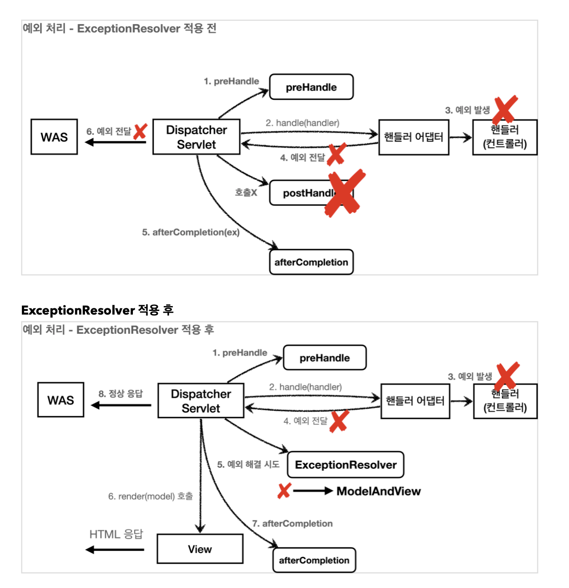

# 8. 예외 처리와 오류 페이지 

# 서블릿 예외 
## 서블릿 예외 처리 방법 
- Exception(예외) 
- response.sendError(HTTP 상태 코드, 오류 메시지)

# Exception 예외 
## 자바 직접 실행 
- 자바 메인을 실행하면, main이라는 이름의 쓰레드가 실행된다. 
- 실행 도중 예외를 잡지 못하면, 예외 정보를 남기고 해당 쓰레드는 종료된다. 

## 웹 어플리케이션 
- 사용자 request 별로 별도의 쓰레드가 할당되고, 서블릿 컨테이너 안에서 실행된다. 
- 실행 중 예외가 발생했을 때, try ~ catch로 예외를 잡지 한다면?  
- `WAS(여기까지 전파) <- 필터 <- 서블릿 <- 인터셉터 <- 컨트롤러(예외발생)`
- ```
  @GetMapping("/error-ex")
  public void errorEx() {
    throw new RuntimeException("예외 발생!");
  }
  ```
- 실행시켜보면 tomcat이 기본으로 제공하는 오류 화면이 나온다. 
- Exception의 경우 서버 내부에서 처리할 수 없는 오류가 발생한 것으로 생각해서 500을 반환한다.
- 컨트롤러에 없는 url을 호출하면 404 오류 화면을 반환한다. 

# response.sendError(HTTP 상태 코드, 오류 메시지)
- HttpServletResponse가 제공하는 `sendError`로 `서블릿 컨테이너`에게 오류가 발생했다고 전달할 수 있다. 
- 이 메서드를 사용하면 HTTP 상태 코드와 오류 메시지도 추가할 수 있다. 
- ```
  response.sendError(HTTP status code)
  response.sendError(HTTP status code, error message)
  ```
- ```
  @GetMapping("/error-404")
  public void error404(HttpServletResponse response) throws IOException {
    response.sendError(404, "404 오류!"); 
  }
  ```
## sendError 흐름 
- `WAS(sendError) <- filter <- servlet <- interceptor <- controller(response.sendError())`
- `response.sendError()`를 호출하면 `response 내부`에 오류가 발생했다는 `상태를 저장`해준다. 
- 서블릿 컨테이너는 응답 전에 sendError()가 호출됐는지 확인한다. 호출됐으면, 오류 코드에 맞추어 기본 오류 페이지를 보여준다. 

# 서블릿 예외 처리 - 오류 화면 제공 
- 서블릿이 제공하는 기본 오류 화면을 custom 할 수 있다. 
- 과거에는 web.xml로 오류 화면을 등록했다. 
  - ```xml
    <web-app> 
      <error-page>
        <error-code>404</error-code>
        <location>/error-page/404.html</location> 
      </error-page>
      <error-page>
        <error-code>500</error-code>
        <location>/error-page/500.html</location> 
      </error-page>
      <error-page>
        <exception-type>java.lang.RuntimeException</exception-type>
        <location>/error-page/500.html</location> 
      </error-page>
    </web-app>
    ```
- 스프링 부트를 통해서 서블릿 컨테이너를 실행하기 때문에, 스프링 부트가 제공하는 기능으로 서블릿 오류 페이지를 등록할 수 있다. 
- ```java
  @Component
  public class WebServerCustomizer implements WebServerFactoryCustomizer<ConfigurableWebServerFactory> {

    @Override
    public void customize(ConfigurableWebServerFactory factory) {
        ErrorPage errorPage404 = new ErrorPage(HttpStatus.NOT_FOUND, "/error-page/404");
        ErrorPage errorPage500 = new ErrorPage(HttpStatus.INTERNAL_SERVER_ERROR, "/error-page/500");

        ErrorPage errorPageEx = new ErrorPage(RuntimeException.class, "/error-page/500");

        factory.addErrorPages(errorPage404, errorPage500, errorPageEx);
    }
  }
  ```
- ```
  @RequestMapping("/error-page/404")
  public String errorPage404(HttpServletRequest request, HttpServletResponse response) throws IOException {
    log.info("errorPage 404");
    response.sendError(404, "404오류!");
  }
  ```
- response.sendError(404) 발생 시 /error-page/404 호출
- 그 외에는 /error-page/505 호출. 
- 해당 예외는 그 자식 타입의 오류까지 함께 처리해서 오류 페이지를 보여준다. 

# 서블릿 예외 처리 - 오류 페이지 작동 원리 
- Exception 가 발생해서 서블릿 밖으로 전달되거나 response.sendError() 가 호출되었을 때 오류 페이지를 찾는다.
## Exception 발생 흐름
- `WAS <- filter <- servlet container <- interceptor <- controller`
## sendError 흐름 
- `WAS <- filter <- servlet container <- interceptor <- controller (response.sendError())`
- WAS는 해당 예외를 처리하는 오류 페이지 정보를 확인한다. 
  + `new ErrorPage(RuntimeException.class, "/error-page/500")`
- 확인 후 WAS는 오류 페이지를 출력하기 위해 /error-page/500를 다시 요청한다. 
## sendError 흐름과 오류 페이지 요청 흐름 
- `WAS <- filter <- servlet container <- interceptor <- controller 예외 발생 (response.sendError())`
- `WAS /error-page/500 다시 요청 -> filter -> servlet container -> interceptor -> controller -> View`
- `중요한 점은 웹 브라우저(클라이언트)는 서버 내부에서 이런 일이 일어나는지 전혀 모른다는 점이다. 오직 서버 내부에서 오류 페이지를 찾기 위해 추가적인 호출을 한다.` 

## 정리 
1. 예외가 발생하면 WAS까지 전파된다. 
2. WAS는 오류 페이지 경로를 찾아서 내부에서 오류 페이지를 호출한다. 이떄 오류 페이지 경로로 필터, 서블릿, 인터셉터, 컨트롤러가 모두 다시 호출된다. 

# 서블릿 예외 처리 - 필터 
- 오류가 발생하면 오류 페이지를 출력하기 위해 WAS 내부에서 다시 한번 호출(/error-page/500)이 발생한다.
- 이때 필터, 서블릿, 인터셉터도 모두 다시 호출된다.
- 로그인 인증 체크같은 경우 이미 인증을 완료했는데, `오류 페이지를 호출로 인해 필터, 인터셉터가 다시 또 호출되는 것은 매우 비효율적이다.`
- 결국 클라이언트로 부터 발생한 요청인지, 아니면 오류 페이지를 출력하기 위한 내부 요청인지 구분할 수 있어야 한다. 
- 서블릿은 이런 문제 해결을 위해 `DispatcherType`이라는 추가 정보를 제공한다. 

## DispatcherType 
- 고객이 처음 요청하면 `dispatcherType=REQUEST`이고, 오류 페이지 호출에서 `dispatcherType=ERROR`로 나온다.
- 서블릿은 실제 고객이 요청한 것인지, 서버가 내부에서 오류 페이지를 요청하는 것인지 dispatcherType으로 구분한다. 
- ```java
  public enum DispatcherType {
      FORWARD, //MVC에서 서블릿 -> 서블릿이나 JSP 호출할 때. RequestDispatcher.forward(request, response);
      INCLUDE, //서블릿에서 다른 서블릿이나 JSP의 결과를 포함할 때. RequestDispatcher.include(request, response);
      REQUEST, //클라이언트 요청 
      ASYNC, //서블릿 비동기 호출 
      ERROR //오류 요청 
  }
  ```

## 필터와 DispatcherType
- 필터를 FilterRegistrationBean으로 등록할 때 `filterRegistrationBean.setDispatcherTypes(DispatcherType.REQUEST, DispatcherType.ERROR)` 두 가지 모두 넣으면 클라이언트 요청은 물론이고, 오류 페이지 요청에서도 필터가 호출된다. 
- `기본은 DispatcherType.REQUEST`이며 클라이언트의 요청이 있는 경우에만 필터가 적용된다. 
- 오류 페이지 전용 필터를 적용하고 싶으면 `filterRegistrationBean.setDispatcherTypes(DispatcherType.ERROR)`만 지정해서 필터를 등록하면 된다. 

# 서블릿 예외 처리 - 인터셉터
## 인터셉터 중복 호출 제거
- 앞서 필터의 경우에는 DispatcherType으로 필터를 적용할 지 선택할 수 있었다. 
- 근데 인터셉터는 서블릿이 제공하는 기능이 아니라 스프링이 제공하는 기능이므로 DispatcherType과 무관하게 항상 호출된다. 
- 대신 인터셉터는 경로에 따라서 추가하거나 제외하기 쉽게 되어 있기 때문에, excludePathPatterns를 사용해서 빼줄 수 있다. 
- ```
  @Override
  public void addInterceptors(InterceptorRegistry registry) {
    registry.addInterceptor(new LogInterceptor())
        .order(1)
        .addPathPatterns("/**")
        .excludePathPatterns("/css/**", "*.ico", "/error", "/error-page/**"); //오류 페이지 경로
  } 
  ```
# 전체 흐름 정리 
## /hello 정상 요청 
- `WAS(/hello, dispatcherType=REQUEST) -> filter -> servlet container -> interceptor -> controller -> view`
## /error-ex 오류 요청 
- ```
  1. WAS(/error-ex, dispatcherType=REQUEST) -> filter -> servlet container -> interceptor -> controller -> view
  2. WAS(여기까지 전파) <- filter <- servlet container <- interceptor -> controller(예외발생)
  3. WAS 오류 페이지 확인 
  4. WAS(/error-page/500, dispatchType=ERROR) -> filter(x) -> servlet container -> interceptor(x) -> controller(/error-page/500) -> view
  ```

# 스프링 부트 - 오류 페이지1 
- 지금까지 에외 처리 페이지를 만들기 위해서 WebServerCustomizer를 만들고, ErrorPage를 추가하고, 예외 처리용 컨트롤러 ErrorPageController를 만듦
- `스프링 부트는 위 과정을 모두 기본으로 제공한다.` 
- `BasicErrorController`라는 스프링 컨트롤러를 자동으로 등록하고, /error를 매핑해서 처리하는 컨트롤러다. ErrorMvcAutoConfiguration에서 오류 페이지를 자동으로 등록 
- `resources/template/error`, `resources/static/error` 위치에 뷰 파일을 넣어두면 알아서 인식된다. 

## BasicErrorController의 처리 순서
- `구체적인 것이 덜 구체적인 것보다 우선순위가 높다.`
1. 뷰 템플릿
  - resources/templates/error/500.html
  - resources/templates/error/5xx.html
2. 정적 리소스(static, public) 
  - resources/static/error/400.html
  - resources/static/error/404.html
  - resources/static/error/4xx.html
3. 적용 대상이 없을 때 뷰 이름  
  - resources/templates/error.html 
 
# 스프링 부트 - 오류 페이지2
- BasicErrorController 는 예외 정보를 model에 담아서 뷰에 전달해준다. 
- ```
  * timestamp: Fri Feb 05 00:00:00 KST 2021
  * status: 400
  * error: Bad Request
  * exception: org.springframework.validation.BindException * trace: 예외 trace
  * message: Validation failed for object='data'. Error count: 1 * errors: Errors(BindingResult)
  * path: 클라이언트 요청 경로 (`/hello`)
    ```
- `실무에서는 이것들을 노출하면 안된다! 서버에 로그를 남겨서 로그로 확인해야 한다.`  


# API 예외 처리 - 시작 
- 지금까지는 HTML 오류 페이지에 대해 알아봤다. 오류 페이지는 단순히 고객에게 오류 화면을 보여주면 끝이다.
- API는 각 오류 상황에 맞는 오류 응답 스펙을 정하고, JSON으로 데이터를 내려주어야 하므로 더 까다롭다.

## API 예외 컨트롤러  
- WebServerCustomizer가 다시 사용되도록 하기 위해 @Component 주석을 풀자 
  + 주석을 해제해야 WAS에 예외가 전달되거나, response.sendError()가 호출될 때 WebServerCustomizer에 설정한 예외 페이지 경로가 호출된다. 
- ```
    @GetMapping("/api/members/{id}")
    public MemberDto getMember(@PathVariable("id") String id) {
        if (id.equals("ex")) {
            throw new RuntimeException("잘못된 사용자");
        }
        return new MemberDto(id, "hello " + id);
    }
  ```
- id 값이 ex 면 예외가 발생하도록 코드를 작성했다. 
- Postman에서 `accept: application/json`으로 변경 후 호출해보자 
- `정상 호출` http://localhost:8080/api/member/spring
  + ```json
    {
      "memberId": "spring", 
      "name": "hello spring" 
    }
    ```
- `예외 호출` http://localhost:8080/api/member/ex
  + ```html 
    <!DOCTYPE HTML>
    <html>
    <head>
    </head>
    <body>
    ...  
    </body>
    ```
- API요청을 해보면, 정상의 경우 JSON 형식으로 데이터가 잘 반환된다. 근데 오류가 발생하면 전에 미리 만들어둔 오류 페이지 HTML이 반환된다.
- 클라이언트는 웹 브라우저가 아닌 이상 HTML을 받아서 처리할 수 없으므로, 오류가 발생해도 JSON으로 응답하도록 바꿔야한다.

## ErrorPageController - API 응답 추가 
- ```java 
    @RequestMapping(value = "/error-page/500", produces = MediaType.APPLICATION_JSON_VALUE)
    public ResponseEntity<Map<String, Object>> errorPage500Api(
            HttpServletRequest request, HttpServletResponse response) {

        log.info("API errorPage 500");

        HashMap<String, Object> result = new HashMap<>();
        Exception ex = (Exception) request.getAttribute(ERROR_EXCEPTION);
        result.put("status", request.getAttribute(ERROR_STATUS_CODE));
        result.put("message", ex.getMessage());

        Integer statusCode = (Integer) request.getAttribute(RequestDispatcher.ERROR_STATUS_CODE);
        return new ResponseEntity<>(result, HttpStatus.valueOf(statusCode));
    }
  ```
- `produces = MediaType.APPLICATION_JSON_VALUE` 를 지정했기 때문에 HTTP header의 `accept`의 값이 `application/json`일 때, 해당 메서드가 호출된다. 
- `ResponseEntity`를 사용해 응답했기 때문에 메시지 컨버터가 동작하면서 JSON 데이터가 반환된다. 
- `예외 재호출` http://localhost:8080/api/member/ex
  + ```json
    {
      "message": "잘못된 사용자",
      "status": 500
    }
    ```

# API 예외 처리 - 스프링 부트 기본 오류 처리 
- 스프링 부트가 제공하는 `BasicErrorController`는 동일한 `/error` 경로를 처리하는 `errorHtml()`, `error()` 두 메서드가 있다.
- ```java 
  @RequestMapping(produces = MediaType.TEXT_HTML_VALUE)
  public ModelAndView errorHtml(HttpServletRequest request, HttpServletResponse response) {}
  
  @RequestMapping
  public ResponseEntity<Map<String, Object>> error(HttpServletRequest request) {}
  ```
- errorHtml()
  + `produces = MediaType.TEXT_HTML_VALUE`, 클라이언트 요청의 `accept` 해더 값이 `text/html`인 경우에 호출해서 `view를 제공`한다. 
- error()
  + errorHtml() 외 경우에 호출되고 ResponseEntity로 HTTP Body에 JSON 데이터를 반환한다. 
- WebServerCustomizer의 @Component를 주석처리하고 http://localhost:8080/api/member/ex를 호출해보자 
- ```json
  {
    "timestamp": "2021-12-05T03:39:14.038+00:00",
    "status": 500,
    "error": "Internal Server Error",
    "path": "/api/members/ex"
  }
  ```

## Html 페이지 vs API 오류 
- BasicController는 4xx, 5xx HTML 오류 페이지를 편리하게 제공해줄 뿐만 아니라 JSON 데이터로 응답해준다. 
- 그러나 회원이나 상품 관련된 API에서 발생하는 예외에 따라 다르게 응답해주고 싶을 때, API 마다 각각의 서로 다른 응답 결과를 출력할 때에는 어려움이 있다. 

# API 예외 처리 - HandlerExceptionResolver 시작 
- 예외가 발생하면 서블릿을 넘어 WAS까지 예외가 전달되고 HTTP 상태 코드가 500으로 처리된다.  
- 발생하는 예외에 따라서 400, 404 등 다른 상태코드로 처리하고, 오류 메시지, 형식 등도 API 마다 다르게 처리하고 싶면? 
- 예를 들어 IllegalArgumentException을 처리하지 못해서 컨트롤러 밖으로 넘어오면 HTTP 상태 코드를 400으로 처리하고싶다. 
- ```java 
    @GetMapping("/api/members/{id}")
    public MemberDto getMember(@PathVariable("id") String id) {
        ...
  
        if (id.equals("bad")) {
            throw new IllegalArgumentException("잘못된 입력 값");
        }
        return new MemberDto(id, "hello " + id);
    }
  ```
- http://localhost:8080/api/members/bad 호출하면 IllegalArgumentException 이 발생하도록 추가함. 실행시 상태코드 500으로 응답한다.  

## HandlerExceptionResolver 
- 스프링 MVC는 컨트롤러(핸들러) 밖으로 예외가 던져진 경우 예외를 해결하고, 동작 방식을 변경하고 싶으면 HandlerExceptionResolver 를 사용하면 된다. 줄여서 ExceptionResolver 라 한다.
- 
- ExceptionResolver로 에외를 해결해도 `postHandle()`은 호출되지 않는다. 
### HandlerExceptionResolver 인터페이스 
- ```java 
  public interface HandlerExceptionResolver {
    ModelAndView resolveException(HttpServletRequest request, HttpServletResponse response,
       Object handler, Exception ex);
  }
  ```
- handler: 핸들러(컨트롤러) 정보
- Exception ex: 핸들러(컨트롤러)에서 발생한 예외 

## MyHandlerExceptionResolver 등록 
- ```java 
  public class MyHandlerExceptionResolver implements HandlerExceptionResolver {

    @Override
    public ModelAndView resolveException(HttpServletRequest request, HttpServletResponse response, Object handler, Exception ex) {
        try {
            if(ex instanceof IllegalArgumentException) {
                log.info("IllegalArgumentException resolver to 400");

                response.sendError(HttpServletResponse.SC_BAD_REQUEST, ex.getMessage());
                return new ModelAndView();
            }

        } catch (IOException e) {
            log.error("resolver ex", e);
        }

        return null;
    }
  }
  ```
- ```java 
  @Configuration
  public class WebConfig implements WebMvcConfigurer {
    ...
    @Override
    public void extendHandlerExceptionResolvers(List<HandlerExceptionResolver> resolvers) {
        resolvers.add(new MyHandlerExceptionResolver());
        resolvers.add(new UserHandlerExceptionResolver());
    }
  }
  ```
- ExceptionResolver가 ModelAndView를 반환하는 이유는 try, catch와 비슷하다. Exception을 처리해서 정상 흐름으로 진행한다. 
- 위 코드는 IllegalArgumentException 이 발생하면 response.sendError(400) 를 호출해서 HTTP 상태 코드를 400으로 지정하고, 빈 ModelAndView 를 반환한다.

## 반환 값에 따른 동작 방식 
- HandlerExceptionResolver 의 반환 값에 따른 DispatcherServlet 의 동작 방식은 다음과 같다.
- `return ModelAndView()` 
  + 뷰를 렌더링 하지 않고, 정상 흐름으로 서블릿이 리턴된다.
- `return ModelAndView("error/500")`
  + 뷰를 렌더링한다. 
- `return null` 
  + 다음 ExceptionResolver를 찾아서 실행한다. 만약 처리할 수 있는 ExceptionResolver가 없으면 발생한 예욀르 서블릿 밖으로 던진다.

## ExceptionResolver 활용 
- 예외 상태 코드 변환
  + 예외를 `response.sendError(xxx)` 호출로 변경해서 서블릿에서 상태 코드에 따른 오류를 처리하도록 위임.
  + 이후 `WAS는 서블릿 오류 페이지를 찾아서 내부 호출`, 예를 들어서 스프링 부트가 기본으로 설정한 / error 가 호출됨
- 뷰 템플릿 처리
  + ModelAndView 에 값을 채워서 예외에 따른 새로운 오류 화면 뷰 렌더링 해서 고객에게 제공
- API 응답 처리
  + response.getWriter().println("hello"); 처럼 HTTP 응답 바디에 직접 데이터를 넣어줘서, JSON 으로 응답처리. 

## PostMan으로 실행 
- http://localhost:8080/api/members/ex HTTP 상태 코드 500 
- http://localhost:8080/api/members/bad HTTP 상태 코드 400

# API 예외 처리 - HandlerExceptionResolver 활용 
- 예외가 발생하면 WAS 까지 예외가 던져지고, 다시 /error를 호출했다. 이 과정은 너무 복잡한데, ExceptionResolver를 활용하면 바로 response를 반환할 수 있다.

### 사용자 정의 예외 추가
- ```java 
  public class UserException extends RuntimeException {
    public UserException() {
        super();
    }

    public UserException(String message) {
        super(message);
    }

    public UserException(String message, Throwable cause) {
        super(message, cause);
    }

    public UserException(Throwable cause) {
        super(cause);
    }

    protected UserException(String message, Throwable cause, boolean enableSuppression, boolean writableStackTrace) {
        super(message, cause, enableSuppression, writableStackTrace);
    }
  }
  ```

### ApiExceptionController - 예외 추가. http://localhost:8080/api/members/user-ex 호출시 UserException 발생 
- ```
    @GetMapping("/api/members/{id}")
    public MemberDto getMember(@PathVariable("id") String id) {
        ...

        if (id.equals("user-bad")) {
            throw  new UserException("사용자 오류");
        }
        return new MemberDto(id, "hello " + id);
    }  
  ```

### UserHandlerExceptionResolver 추가 
- ```java
  public class UserHandlerExceptionResolver implements HandlerExceptionResolver {

    private final ObjectMapper objectMapper = new ObjectMapper();

    @Override
    public ModelAndView resolveException(HttpServletRequest request, HttpServletResponse response, Object handler, Exception ex) {
        try {
            if (ex instanceof UserException) {
                log.info("UserException resolver to 400");
                String acceptHeader = request.getHeader("accept");
                response.setStatus(HttpServletResponse.SC_BAD_REQUEST);

                if("application/json".equals(acceptHeader)) {
                    Map<String, Object> errorResult = new HashMap<>();
                    errorResult.put("ex", ex.getClass());
                    errorResult.put("message", ex.getMessage());

                    response.setContentType("application/json");
                    response.setCharacterEncoding("utf-8");
                    response.getWriter().write(objectMapper.writeValueAsString(errorResult));
                    return new ModelAndView();
                }
            } else {
                return new ModelAndView("error/500");
            }

        } catch (IOException e) {
            log.error("resolver ex", e);
        }

        return null;
    }
  }
  ```
- accept 헤더 값이 application/json이면 JSON으로 반환하고, 그 외의 경우에는 error/500에 있는 HTML 오류 페이지를 보여준다. 

## 정리 
- `ExceptionResolver`를 사용하면 컨트롤러에서 예외가 발생해도, `ExceptionResolver`에서 예외를 처리할 수 있다.  
- 즉, 예외가 발생해도 서블릿 컨테이너까지 전달되지 않고, 스프링 MVC에서 예외 처리가 끝난다. `예외를 이곳에서 모두 처리할 수 있다는 것이 핵심이다.` 
- UserHandlerExceptionResolver를 구현해보니 상당히 복잡했다. 지금부터 스프링이 제공하는 `ExceptionResolver`를 알아보자 .

# APi 예외 처리 - 스프링이 제공하는 ExceptionResolver1 
- 스프링 부트가 기본으로 제공하는 `ExceptionResolver` 순서는 다음과 같다 
- ```
  1. ExceptionHandlerExceptionResolver
  2. ResponseStatusExceptionResolver
  3. DefaultHandlerExceptionResolver //우선 순위가 가장 낮다.
  ```
- `ExceptionHandlerExceptionResolver`
  + @ExceptionHandler 을 처리한다. API 예외 처리는 대부분 이 기능으로 해결한다. 
- `ResponseStatusExceptionResolver`
  + HTTP 상태 코드를 지정해준다.
  + 예) @ResponseStatus(value = HttpStatus.NOT_FOUND)
- `DefaultHandlerExceptionResolver`
  + 스프링 내부 기본 예외를 처리한다.

## ResponseStatusExceptionResolver
- 예외에 따라서 HTTP 상태 코드를 지정해주는 역할을 한다. 
### `@ResponseStatus`가 달려있는 예외
- ```java
  @ResponseStatus(code = HttpStatus.BAD_REQUEST, reason = "잘못된 요청 오류") 
  public class BadRequestException extends RuntimeException {
  }
  ```
- `throw new BadRequestException`로 예외가 컨트롤러 밖으로 넘어가면 `ResponseStatusExceptionResolver 예외가 해당 애노테이션을 확인`해서 오류 코드를 `HttpStatus.BAD_REQUEST(400)`로 변경하고, "잘못된 요청 오류" 메시지도 담는다. 
- ResponseStatusExceptionResolver 코드를 확인해보면 결국 response.sendError(statusCode, resolvedReason)을 호출하므로, WAS에서 다시 오류 페이지(/error)를 내부 요청한다. 
- `reason`은 `MessageSource`에서 찾는 기능도 제공한다. `reason = "error.bad"`
  + messages.properties `error.bad=잘못된 요청 오류입니다. 메시지 사용`
  
### `ResponseStatusException` 예외 
- @ResponseStatus는 애노테이션을 직접 넣어야하는데, 라이브러리 등에서는 코드를 직접 수정할 수 없기 때문에 적용할 수 없다. 
- 이때는 다음과 같이 사용하면 된다. 
- ```
    @GetMapping("/api/response-status-ex2")
    public String responseStatusEx2() {
        throw new ResponseStatusException(HttpStatus.NOT_FOUND, "error.bad", new IllegalArgumentException());
    }
  ```

## `DefaultHandlerExceptionResolver`
- 스프링 내부에서 발생하는 스프링 예외를 해결한다. 
- 대표적으로 파라미터 바인딩 시점에 타입이 맞지 않을때 TypeMismatchException이 발생한다. 이 경우 그대로 두면 서블릿 컨테이너까지 오류가 올라가고 결국 500 오류가 발생한다. 
- `DefaultHandlerExceptionResolver`는 이 경우 500 오류가 아니라 HTTP 상태 코드 400 오류로 변경한다.
- DefaultHandlerExceptionResolver 코드를 확인해보면 sendError(400)을 호출하는데, 결국 WAS에서 다시 오류 페이지(/error)를 내부 요청한다. 
- ```
  protected ModelAndView handleHttpMessageNotReadable(HttpMessageNotReadableException ex, HttpServletRequest request, HttpServletResponse response, @Nullable Object handler) throws IOException {
        response.sendError(400);
        return new ModelAndView();
  }
  ```
- ```
  @GetMapping("/api/default-handler-ex")
  public String defaultException(@RequestParam Integer data) {
    return "ok";
  }
  ```
- http://localhost:8080/api/default-handler-ex?data=hello&message= 호출 시 TypeMismatchException 발생 
- 지금까지 HTTP 예외 상태 코드를 변경하는 방법을 알아봤다. 근데 API의 경우 response에 직접 데이터를 넣어야해서 불편하고, 또 ModelAndView를 반환해야 한다는 점이 API에 잘 맞지않는다. 

# API 예외 처리 - @ExceptionHandler 
- 웹 브라우저에 HTML 화면을 제공할때 오류가 발생하면 `BasicController`를 사용하는게 편하다. 
- 그러나 API는 더 세밀하게 예외 응답을 내려줘야한다. 
- 지금까지 살펴본 `BasicErrorController`, `HandlerExceptionResolver`로는 API 예외를 다루기 쉽지 않다. 

## @ExceptionHandler
- 스프링은 API 예외 처리 문제를 `@ExceptionHandler` 라는 어노테이션으로 해결하는데, 이게 바로 `ExceptionHandlerExceptionResolver`다 
- ```java 
  @Data
  @AllArgsConstructor
  public class ErrorResult {
    private String code;
    private String message;
  }
  ```
- ```java
  @Slf4j
  @RestController
  public class ApiExceptionV2Controller {
  
    @ResponseStatus(HttpStatus.BAD_REQUEST)
    @ExceptionHandler(IllegalArgumentException.class)
    public ErrorResult illegalExHandler(IllegalArgumentException e) {
        log.error("[exceptionHandler] ex", e);
        return new ErrorResult("BAD", e.getMessage());
    }

    @ExceptionHandler
    public ResponseEntity<ErrorResult> userExHandler(UserException e) {
        log.error("[exceptionHandler] ex", e);
        return new ResponseEntity<>(new ErrorResult("USER-EX", e.getMessage()), HttpStatus.BAD_REQUEST);
    }

    @ResponseStatus(HttpStatus.INTERNAL_SERVER_ERROR)
    @ExceptionHandler
    public ErrorResult exHandler(Exception e) {
        log.error("[exceptionHandler] ex", e);
        return new ErrorResult("EX", e.getMessage());
    }

    @GetMapping("/api2/members/{id}")
    public MemberDto getMember(@PathVariable("id") String id) {
        if (id.equals("ex")) {
            throw new RuntimeException("잘못된 사용자");
        }
        if (id.equals("bad")) {
            throw new IllegalArgumentException("잘못된 입력 값");
        }

        if (id.equals("user-ex")) {
            throw new UserException("사용자 오류");
        }
        return new MemberDto(id, "hello " + id);
    }

    @Data
    @AllArgsConstructor
    static class MemberDto {
        private String memberId;
        private String name;
    }
  }
  ```
- @ExceptionHandler 애노테이션을 선언하고, 해당 컨트롤러에서 사용하고 싶은 예외를 지정하면 된다. 그러면 그 자식클래스까지 모두 잡을 수 있다.
- ```
    @ResponseStatus(HttpStatus.BAD_REQUEST)
    @ExceptionHandler(IllegalArgumentException.class)
    public ErrorResult illegalExHandler(IllegalArgumentException e) {
        log.error("[exceptionHandler] ex", e);
        return new ErrorResult("BAD", e.getMessage());
    }
  ```
### 우선 순위 
- ```
  @ExceptionHandler(부모예외.class) 
  public String 부모예외처리()(부모예외 e) {}
  
  @ExceptionHandler(자식예외.class) 
  public String 자식예외처리()(자식예외 e) {}
  ```
- @ExceptionHandler에 지정한 부모 클래스는 자식 클래스까지 처리할 수 있다. 
- 호출 순서는 더 자세한 것이 우선권을 갖게된다. 
### 여러개 예외 
- ```
  @ExceptionHandler({AException.class, BException.class}) 
  public String ex(Exception e) {
    log.info("exception e", e); 
  }
  ```
### 예외 생략 
- 예외를 생략하면 메서드 파라미터의 예외가 지정된다. 
- ```
  @ExceptionHandler
  public ResponseEntity<ErrorResult> userExHandle(UserException e) {}
  ```
### 파라미터와 응답 
- @ExceptionHandler는 마치 컨트롤러처럼 동작한다. 다양한 파라미터와 응답을 지정할 수 있다. 

## 실행 흐름
- http://localhost:8080/api2/members/bad 호출 
- 컨트롤러를 호출한 결과 IllegalArgumentException 예외가 컨트롤러 밖으로 던져진다. 
- 예외가 발생했으로 `ExceptionResolver` 가 작동한다. 
- `가장 우선순위가 높은 ExceptionHandlerExceptionResolver 가 실행된다.`
- ExceptionHandlerExceptionResolver 는 `해당 컨트롤러에 IllegalArgumentException 을 처리할 수 있는 @ExceptionHandler 가 있는지 확인한다.`
- illegalExHandle() 를 실행한다. @RestController 이므로 illegalExHandle() 에도 `@ResponseBody` 가 적용된다. 
- `따라서 HTTP 컨버터가 사용되고, 응답이 다음과 같은 JSON으로 반환된다.` @ResponseStatus(HttpStatus.BAD_REQUEST) 를 지정했으므로 HTTP 상태 코드 400으로 응답한다.

# API 예외 처리 - @ControllerAdvice 
- `@ExceptionHandler`로 예외를 깔끔하게 처리했지만, 코드가 하나의 컨트롤러에 섞여있다. 
- `@ControllerAdvice` 혹은 `@RestControllerAdvice` 를 사용하면 둘을 분리할 수 있다.
- @ControllerAdvice 는 대상으로 지정한 여러 컨트롤러에 @ExceptionHandler , @InitBinder 기능을 부여해주는 역할을 한다.
- @ControllerAdvice 에 대상을 지정하지 않으면 모든 컨트롤러에 적용된다. (글로벌 적용)

## 대상 컨트롤러 지정 방법 
- ```java
  // Target all Controllers annotated with @RestController
  @ControllerAdvice(annotations = RestController.class) 
  public class ExampleAdvice1 {}
  
  // Target all Controllers within specific packages
  @ControllerAdvice("org.example.controllers") 
  public class ExampleAdvice2 {}
  
  // Target all Controllers assignable to specific classes
  @ControllerAdvice(assignableTypes = {ControllerInterface.class, AbstractController.class})
  public class ExampleAdvice3 {}
  ```