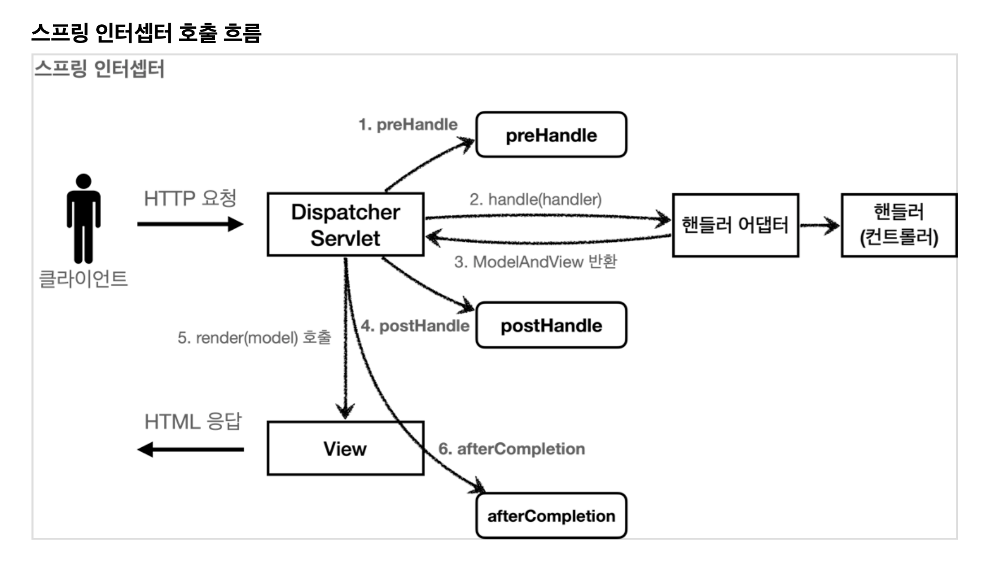
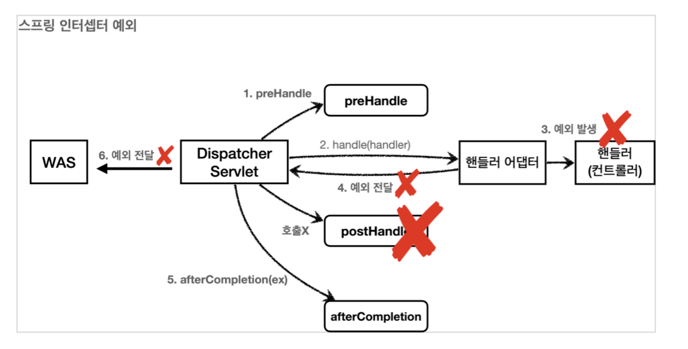

# 6. 로그인 처리1 - 쿠키, 세션

## 패키지 구조 설명 
- `도메인` 화면, UI, 기술 인프라 등등의 영역을 제외한 시스템이 구현해야 하는 핵심 비즈니스 업무 영역 
- 향후 web을 다른 기술로 바꾸어도 도메인은 그대로 유지할 수 있어야 한다.
- 이렇게 하려면 web은 domain을 알고있지만 domain은 web을 모르도록 설계해야 한다.
- web 패키지를 모두 삭제해도 domain에는 전혀 영향이 없도록 의존관계를 설계하는 것이 중요하다. 


# 로그인 처리하기 - 쿠키 사용 
- HTTP는 stateless이므로 쿠키로 사용자 정보를 저장한다. 
- 서버에서 로그인에 성공하면 HTTP 응답에 쿠키를 담아서 브라우저에 전달하자. 그러면 `브라우저는 앞으로 해당 쿠키를 지속해서 보내준다.`

## 쿠키 종류
  + `영속 쿠키`: 만료 날짜를 입력하면 해당 날짜까지 유지
  + `세션 쿠키`: 만료 날짜를 생략하면 브라우저 종료시 까지만 유지

## 쿠키 동작 방식 
- 클라이언트가 사용자 정보 전달 
- 서버는 사용자가 맞는지 디비에서 확인 
- 서버에서 쿠키 생성 
- 서버는 클라이언트에 `Set-Cookie: memberId=1`로 쿠키에 담아서 전달 
- 사용자 쿠키 저장소에 `member=1` 저장
- 클라이언트는 요청시 항상 `Cookie: memberId=1`로 쿠키를 전달한다.

## 쿠키 생성 로직 
- ```
  //쿠키에 시간 정보를 주지 않으면 세션 쿠키(브라우저 종료시 모두 종료)
  Cookie idCookie = new Cookie("memberId", String.valueOf(loginMember.getId()));
  response.addCookie(idCookie);
  ```
- `@CoolieValue(name = "memberId")`로 컨트롤러에서 편리하게 쿠키를 조회할 수 있다. 

## 로그아웃 기능 
- 해당 쿠키의 종료 날짜를 0으로 지정 
- ```
  Cookie cookie = new Cookie("memberId", null);
  cookie.setMaxAge(0);
  response.addCookie(cookie);
  ```

## 쿠키와 보안 문제 
- `쿠키의 값은 임의로 변경할 수 있다.`
  + 웹브라우저에서 쿠키 값을 강제로 변경하면, 다른 사용자가 될 수 있다. 
- `쿠키에 보관된 정보는 훔쳐갈 수 있다.` 
  + 쿠키에 개인정보나, 신용카드 정보가 있을 수 있다. 
  + 쿠키의 정보로 나의 로컬 PC가 털릴 수 있고, 네트워크 전송 구간에서 털릴 수 있다.
- `해커가 쿠키를 한 번 훔쳐가면 평생 사용할 수 있다.`
  + 해커가 쿠키를 훔쳐가서 그 쿠키로 악의적인 요청을 계속 시도할 수 있다. 

### 대안 
- 사용자별로 예측이 불가능한 임의의 토큰값을 노출하고, 서버에서 토큰을 관리한다.
- 해커가 토큰을 털어가도 시간이 지나면 사용할 수 없도록 서버에서 해당 토큰의 만료시간을 짧게 유지한다. 해킹이 의심되는 경우 서버에서 해당 토큰을 강제로 제거하면 된다. 

# 로그인 처리하기 - 세션 동작 방식 
- 서버에 중요한 정보를 보관하고 연결을 유지하는 방법을 세션이라함. 
- 
## 세션 동작 방식
### 로그인
- 클라이언트가 사용자 정보 전달 
- 서버는 사용자가 맞는지 디비에서 확인 
- 추적이 불가능한 세션 ID를 생성. `MySessionId=zz0101023...`
- 생성된 세션 ID와 값을 서버의 `세션 저장소`에 보관. `sessionId=zz0101023..., value=memberA` 
- 서버는 클라이언트에 `mySessionId`라는 이름으로 세션ID만 쿠키에 담아서 전달. `Set-Cookie:mySessionId=zz0101023...` 
- 클라이언트는 요청시 항상 mySessionId 쿠키를 전달한다. `Cookie:mySessionId=zz0101023...` 
### 로그인 이후 
- 클라이언트는 요청시 항상 `mySessionId` 쿠키를 전달
- 서브는 클라이언트가 전달한 `mySessionId` 쿠키 정보로 로그인시 보관한 세션 저장소에서 세션 정보를 사용

## 세션 중요한 포인트 
- 클라이언트에게 회원과 관련된 정보를 전달하지 않는다. 
- `추척 불가능한 세션ID만 쿠키를 통해 클라이언트에게 전달한다.` 

## 세션과 보안 문제
- 세션을 사용하면 쿠키에서 발생했던 보안 문제를 해결할 수 있다. 
- 쿠키값 변조 가능 -> 예측 불가능한 복잡한 세션ID 사용 
- 쿠키 정보 해킹 -> 세션ID로는 중요한 정보를 알 수 없다. 
- 쿠키 탈취 후 사용 -> 세션의 만료 시간을 짧게 유지. 해킹이 의심되는 경우 세션을 강제로 제거 


# HttpSession
- 서블릿이 제공하는 HttpSession도 결국 우리가 만든 SessionManager와 같은 방식으로 동작함
- `서블릿을 통해 HttpSession을 생성하면 JSESSIONID라는 이름으로 쿠키가 생성되고, 값은 추정 불가능한 랜덤 값이다.` 
- `Cookie: JSESSIONID=5B78172AB2918D24J132`

## HttpSession 사용 
- ```
  //로그인 성공 
  //세션이 있으면 있는 세션 반환, 없으면 신규 세션 생성
  HttpSession session = request.getSession();
  //세션에 로그인 회원 정보 보관
  session.setAttribute(SessionConst.LOGIN_MEMBER, loginMember);
  ```
- `request.getSession() == request.getSession(true)`
  + 세션이 있으면 있는 세션 반환, 없으면 신규 세션 생성
- `request.getSession(false)`
  + 세션이 있으면 있는 세션 반환, 없으면 신규 세션 생성안하고 null을 반환 
- `스프링은 세션을 더 편리하게 사용할 수 있도록 @SessionAttribute 을 지원한다.`
  + `@SessionAttribute(name = "loginMember", required = false) Member loginMember`
  + 이 기능은 세션을 생성하지 않는다.
- 세션은 사용자가 로그아웃을 직접 호출해서 `session.invalidate()` 가 호출 되는 경우에 삭제된다.

## 세션 종료 시점 
- 세션 종료 시간을 30분으로 잡아놨다고 가정해보자. 유저는 열심히 사이트를 돌아다니다가 30분 뒤에는 다시 로그인을 해야할 것이다. 
- 사용자가 서버에 마지막에 요청한 시간을 기준으로 30분 정도로 계속 연장시켜주면, 유저는 30분마다 로그인해야하는 번거로움이 사라진다.
- `HttpSession`은 이 방식을 사용한다. 
- 세션 타임아웃 설정은 application.properties에 `server.servlet.session.timeout=60`으로 설정 가능  

## 세션 주의사항 
- 세션에는 `최소한의 데이터만 보관`해야 한다. 
- 보관한 데이터 용량 * 사용자 수로 세션의 메모리 사용량이 급격하게 늘어나서 장애로 이어질 수 있다. 
- 추가로 `세션의 시간을 너무 길게 가져가면 메모리 사용이 계속 누적 될 수 있으므로 적당한 시간을 선택`하는 것이 필요하다. 


# 7. 로그인 처리2 - 필터, 인터셉터

# 필터 
- `공통 인증에 관한 로직`을 처리할 때 사용하면 좋다. `서블릿이 제공하는 기술`
- AOP와 달리 `HttpServletReqeust`를 제공받을 수 있다. 

## 필터 제한 
- ```
  HTTP 요청 -> WAS -> 필터 -> 서블릿 -> 컨트롤러 //로그인 사용자
  HTTP 요청 -> WAS -> 필터(적절하지 않은 요청이라 판단, 서블릿 호출X) //비 로그인 사용자
  ```

## 필터 흐름
- `HTTP 요청 -> WAS -> 필터 -> 서블릿(디스패처 서블릿) -> 컨트롤러` 
- 필터에서 적절하지 않은 요청이라고 판단하면 거기에서 끝을 낼 수 있으므로 로그인 여부를 체크하기에 좋다. 

## 필터 체인 
- `HTTP 요청 -> WAS -> 필터1 -> 필터2 -> 필터3 -> 서블릿(디스패처 서블릿) -> 컨트롤러`
- 필터는 체인으로 구성되어있고, 중간에 필터를 자유롭게 추가할 수 있다. 

## 필터 인터페이스 
- ```java
  public interface Filter {
      public default void init(FilterConfig filterConfig) throws ServletException{}
  
      public void doFilter(ServletRequest request, ServletResponse response,
              FilterChain chain) throws IOException, ServletException;
      
      public default void destroy() {}
   }
  ```
- 서블릿 컨테이너가 필터를 싱글톤 객체로 생성하고, 관리한다. 
- `init()`: 필터 초기화. 서블릿 컨테이너가 생성될 때 호출. 
- `doFilter()`: 고객 요청이 올 때마다 호출. 
- `destroy()`: 필터 종료. 서블릿 메서드가 종료될때 호출.

# 서블릿 필터 - 요청로그 
- 모든 요청을 로그로 남기는 필터를 적용해보자.

## 필터 생성 
- ```java   
  @Slf4j 
  public class LogFilter implements Filter {
    @Override
    public void init(FilterConfig filterConfig) throws ServletException {
      log.info("log filter init");
    }
  
    @Override
    public void doFilter(ServletRequest request, ServletResponse response, FilterChain chain) throws IOException, ServletException {
       HttpServletRequest httpRequest = (HttpServletRequest) request;
       String requestURI = httpRequest.getRequestURI();
  
        try {
           log.info("REQUEST [{}][{}]", uuid, requestURI); 
           chain.doFilter(request, response);
        } catch (Exception e) {
           throw e;
        } finally {
           log.info("RESPONSE [{}][{}]", uuid, requestURI);
        }
    }
    
    @Override
    public void destroy() {
      log.info("log filter destroy");
    }
  
  } 
  ```
- `ServletRequest request`는 HTTP 요청이 아닌 경우까지 고려해서 만든 인터페이스이다. 
- `HttpServletRequest httpRequest = (HttpServletRequest) request;` 다운 케스팅으로 HTTP를 사용하면 된다. 
- `chain.doFilter(request, response);` 이 부분이 가장 중요하다. 다음 필터가 있으면 필터를 호출하고, 필터가 없으면 디스패처 서블릿을 호출한다. 
- 만약 이 로직이 없다면, 필터가 있어도 다음 필터를 호출하지 않고 컨트롤러도 호출하지 않고 끝나버린다.. 

## 필터 적용 
- ```java 
  @Configuration
  public class WebConfig {
     @Bean
     public FilterRegistrationBean logFilter() {
         FilterRegistrationBean<Filter> filterRegistrationBean = new FilterRegistrationBean<>();
         filterRegistrationBean.setFilter(new LogFilter());  //등록할 필터 지정
         filterRegistrationBean.setOrder(1); 
         filterRegistrationBean.addUrlPatterns("/*"); 
         return filterRegistrationBean;
     } 
  }
  ```
- 여러가지 필터 등록법이 있지만, 스프링 부트는 `FilterRegistrationBean`을 사용하면 된다. 
  + `setFilter(new LogFilter())`: 등록할 필터 지정
  + `setOrder`: 필터는 체인으로 동작하므로 순서를 지정할 수 있다.  
  + `addUrlPatterns("/*")`: 필터를 적용할 URL 패턴을 지정한다.
- @ServletComponentScan @WebFilter(filterName = "logFilter", urlPatterns = "/*") 로 필터 등록이 가능하지만 필터 순서 조절이 안된다. `FilterRegistrationBean`를 권장한다. 

# 서블릿 필터 - 인증 체크 
- 로그인 여부를 체크해보자.
- ```java
   @Slf4j
   public class LoginCheckFilter implements Filter {
     private static final String[] whitelist = {"/", "/members/add", "/login", "/logout", "/css/*"};

     @Override
     public void doFilter(ServletRequest request, ServletResponse response, FilterChain chain) throws IOException, ServletException {
        HttpServletRequest httpRequest = (HttpServletRequest) request;
        String requestURI = httpRequest.getRequestURI();

        HttpServletResponse httpResponse = (HttpServletResponse) response;

        try {
            log.info("인증 체크 필터 시작{}", requestURI);

            if (isLoginCheckPath((requestURI))) {
                log.info("인증 체크 로직 실행 {}", requestURI);
                HttpSession session = httpRequest.getSession(false);
                if (session == null || session.getAttribute(SessionConst.LOGIN_MEMBER) == null) {
                    log.info("미인증 사용자 요청 {}", requestURI);
                    //로그인으로 redirect
                    httpResponse.sendRedirect("/login?redirectURL=" + requestURI);
                    return; //미인증 사용자는 요청 끝! 컨틀롤러를 호출하지 않음.
                }
            }

            chain.doFilter(request, response);
            } catch (Exception e) {
                throw e;
            } finally {
                log.info("인증 체크 필터 종료 {}", requestURI);
            }
        }
    
        /**
         * 화이트 리스트의 경우 인증 체크X
         */
        public boolean isLoginCheckPath(String requestURI) {
            return !PatternMatchUtils.simpleMatch(whitelist, requestURI);
        }
   }
   ```
- `whitelist = { "/", "/members/add", "/login", "/logout", "/css/*" };`
  + 인증 필터와 무관하게 위 경로는 항상 허용한다. 나머지 경로는 인증 체크 로직을 적용 
- `httpResponse.sendRedirect("/login?redirectURL=" + requestURI);`
  + 미인증 사용자는 로그인 화면으로 리다이렉트 해주자. 
  + 근데 로그인한 후에 무조건 홈으로 이동하면 사용자가 불편하다. 로그인에 성공하면 이전에 보던 페이지로 다시 돌아가는 것이 좋다.
    - 예를들어 상품 관리 화면을 보려고 들어갔다가 로그인 화면으로 이동하면, 로그인 이후에 메인이 아닌 다시 상품 관리 화면으로 들어가는 것이 좋다. 
  + 이를 위해 컨트롤러 요청시 파라미터로 redirectURL을 넘겨주자. 

## 필터 정리 
- 서블릿 필터를 적용한 덕분에 로그인하지 않은 사용자는 나머지 경로에 들어갈 수 없게 됐다. 
- 향후 로그인 정책이 변경되어도 서블릿 필터 부분만 변경하면 된다.

# 인터셉터
- 서블릿 필터 처럼 공통 관심 사항을 효과적으로 해결할 수 있는 기술
- `서블릿 필터`: `서블릿이 제공하는 기술`
- `스프링 인터셉터`: `스프링 MVC가 제공하는 기술`
- 둘 다 웹과 관련된 `공통 관심 사항`을 처리하지만, `적용되는 순서와 범위, 사용방법이 다르다.` 

## 스프링 인터셉터 흐름 
- ```
  HTTP 요청 -> WAS -> 필터 -> 서블릿 -> 스프링 인터셉터 -> 컨트롤러 
  ```
- 스프링 인터셉터는 컨트롤러 호출 직전에 호출된다 
- 스프링 인터셉터에도 URL 패턴을 적용할 수 있는데, 서블릿 URL 패턴과 다르게 매우 정밀하게 설정할 수 있다. 

## 스프링 인터셉터 제한
- ```
  HTTP 요청 -> WAS -> 필터 -> 서블릿 -> 스프링 인터셉터 -> 컨트롤러 //로그인 사용자 
  HTTP 요청 -> WAS -> 필터 -> 서블릿 -> 스프링 인터셉터(적절하지 않은 요청이면, 컨트롤러 호출X) //비 로그인 사용자 
  ```

## 스프링 인터셉터 체인 
- ```
  HTTP 요청 -> WAS -> 필터 -> 서블릿 -> 인터셉터1 -> 인터셉터2 -> 컨트롤러 
  ```
  
## 스프링 인터셉터 인터페이스 
- 스프링 인터셉터를 사용하려면 `HandlerInterceptor` 인터페이스를 구현하면 된다. 
- ```java
  public interface HandlerInterceptor {
    default boolean preHandle(HttpServletRequest request, HttpServletResponse response, Object handler) throws Exception { }
  
    default void postHandle(HttpServletRequest request, HttpServletResponse response, Object handler, @Nullable ModelAndView modelAndView) throws Exception { }
  
    default void afterCompletion(HttpServletRequest request, HttpServletResponse response, Object handler, @Nullable Exception ex) throws Exception { }
  }
  ```
- 서블릿 필터의 경우 `doFilter()`만 제공된다. 
- 인터셉터의 경우 컨트롤러 `호출 전(preHandle)`, `호출 후(postHandle)`, `요청 완료 이후(afterCompletion)`와 같이 단계적으로 나뉘어져있다. 
- 서블릿 필터의 경우 단순히 request, response만 제공했지만, `인터셉터는 어떤 컨트롤러(handler)가 호출되는지 호출 정보`도 받을 수 있다. 
- 그리고 어떤 `modelAndView`가 반환되는지도 알 수 있다.

## 인터셉터 호출 흐름  
- 
- `preHandle`: 컨트롤러 호출 전에 호출된다. 리턴값이 true이면 다음으로 진행하고, false이면 나머지 인터셉터는 물론이고, 핸들러 어댑터도 호출되지 않고 그냥 끝나버린다.
- `postHandle`: 컨트롤러 호출 후에 호출된다. 
- `afterCompletion`: 뷰가 렌더링 된 이후에 호출된다. 

## 인터셉터 예외 발생시 
- 
- `preHandle`: 컨트롤러 호출 전에 호출된다. 
- `postHandle`: 컨트롤러에서 예외가 발생하면 postHandle은 호출되지 않는다. 
- `afterCompletion`: `afterCompletion은 예외가 발생해도 항상 호출된다.` 

## 인터셉터 적용
- ```java
  @Slf4j
  public class LogInterceptor implements HandlerInterceptor {
    public static final String LOG_ID = "logId";
    
    @Override
    public boolean preHandle(HttpServletRequest request, HttpServletResponse response, Object handler) throws Exception {
        String requestURI = request.getRequestURI();
        String uuid = UUID.randomUUID().toString();
  
          request.setAttribute(LOG_ID, uuid);
  
          //@RequestMapping: HandlerMethod
          //정적 리소드: ResourceHttpRequestHandler
          if (handler instanceof HandlerMethod) {
              HandlerMethod hm = (HandlerMethod) handler;//호출할 컨트롤러 메서드의 모든 정보가 포함되어 있다.
          }
  
          log.info("REQUEST [{}][{}][{}]", uuid, requestURI, handler);
          return true;
      }
  
      @Override
      public void postHandle(HttpServletRequest request, HttpServletResponse response, Object handler, ModelAndView modelAndView) throws Exception {
          log.info("postHandle [{}]", modelAndView);
      }
  
      @Override
      public void afterCompletion(HttpServletRequest request, HttpServletResponse response, Object handler, Exception ex) throws Exception {
          String requestURI = request.getRequestURI();
          String logId = (String)request.getAttribute(LOG_ID);
          log.info("RESPONSE [{}][{}]", logId, requestURI, handler);
          if (ex != null) {
              log.error("afterCompletion error!!!", ex);
          }
      }
  }
  ``` 
- `request.setAttrivute(LOG_ID, uuid)`
  + 스프링 인터셉터는 호출 시점이 완전히 분리되어 있어서, preHandle에서 지정한 uuid 값을 postHandle, afterCompletion에서도 사용하려면 어딘가에 담아두어야 한다. 
  + `LogInterceptor도 싱글톤처럼 사용되기 때문에 멤버변수를 이용해 값을 넘겨주면 위험하다.` 
  + 따라서 `afterCompletion`에서 request.getAttribute(LOG_ID)로 찾아서 사용하자
- `handler instanceof HandlerMethod`
  + 핸들러 매핑에 따라 드렁오는 핸들러가 달라진다. 
  + 스프링을 사용하면 일반적으로 `@Controller`, `@RequestMapping`을 활용한 핸들러 매핑을 사용하는데, 이 경우 HandlerMethod가 넘어온다. 
  + `/resources/static`와 같이 정적 리소스가 호출되면 ResourceHttpRequestHandler가 핸들러 정보로 넘어오게 된다. 

## 인터셉터 등록 
- ```java
  @Configuration
  public class WebConfig implements WebMvcConfigurer {
    
      @Override
      public void addInterceptors(InterceptorRegistry registry) {
          registry.addInterceptor(new LogInterceptor())
                  .order(1)
                  .addPathPatterns("/**")
                  .excludePathPatterns("/css/**", "/*.ico", "/error");
      }
  }
  ```
- `addPathPatterns`: 인터셉터를 적용할 URL 패턴 
- `excludePathPatterns`: 인터셉터에서 제외할 패턴을 지정 
- `필터와 비교해보면 인터셉터는 addPathPatterns , excludePathPatterns 로 매우 정밀하게 URL 패턴을 지정할 수 있다.`

## 정리 
- `서블릿 필터`와 `스프링 인터셉터`는 웹과 관련된 `공통 관심사`를 해결하기 위한 기술이다.
- 서블릿 필터와 비교해서 스프링 `인터셉터가 개발자 입장에서 훨씬 편리하다`는 것을 코드로 이해했을 것이다. 
- `특별한 문제가 없다면 인터셉터를 사용하는 것이 좋다.`


# ArgumentResolver 활용 
- @Login 애노테이션이 있으면 직접 만든 ArgumentResolver가 동작해서 세션에 있는 로그인 회원을 찾아주고, 만약 세션에 없다면 null 반환하도록 개발
- `public String homeLoginV3ArgumentResolver(@Login Member loginMember)`
- ```java
  @Target(ElementType.PARAMETER)
  @Retention(RetentionPolicy.RUNTIME) 
  public @interface Login {
  } 
  ```
- LoginMemberArgumentResolver 구현 
- ```java
  @Slf4j
  public class LoginMemberArgumentResolver implements HandlerMethodArgumentResolver {
      @Override
      public boolean supportsParameter(MethodParameter parameter) {
          log.info("supportsParameter 실행");
  
          boolean hasLoginAnnotation = parameter.hasParameterAnnotation(Login.class); //@Login 어노테이션이 있으면
          boolean hasMemberType = Member.class.isAssignableFrom(parameter.getParameterType()); //Member class 타입이면
  
          return hasLoginAnnotation && hasMemberType;
      }
  
      @Override
      public Object resolveArgument(MethodParameter parameter, ModelAndViewContainer mavContainer, NativeWebRequest webRequest, WebDataBinderFactory binderFactory) throws Exception {
          log.info("resolveArgument 실행");
  
          HttpServletRequest request = (HttpServletRequest) webRequest.getNativeRequest();
          HttpSession session = request.getSession(false); //세션 가져오기 
          if(session == null) {
              return null;
          }
  
          return session.getAttribute(SessionConst.LOGIN_MEMBER); //Member 객체 찾아서 반환 
      }
  }
  ```
- LoginMemberArgumentResolver 등록 
- ```java
  @Configuration
  public class WebConfig implements WebMvcConfigurer {
      @Override
      public void addArgumentResolvers(List<HandlerMethodArgumentResolver> resolvers) {
          resolvers.add(new LoginMemberArgumentResolver());
      }
  }

  ```


